[](https://codecov.io/gh/SwiftEnProfundidad/essential-feed-case-Auth)
[](https://codecov.io/gh/SwiftEnProfundidad/essential-feed-case-Auth)

# Essential App Case Study with Security Features
## App Architecture Diagram


## Architectural Decision: Composer vs Coordinator

**Note:** This proof-of-concept project centralizes navigation in the Composer to keep things simple and to focus on practicing Clean Architecture, modularization, and TDD.

- **Advantage:** Allows for experimentation and learning without overengineering.
- **Limitation:** If the app grows significantly, the Composer can become a "God Object," making scalability and maintenance more difficult.

**Professional recommendation:**
- For real and scalable projects, migrate to a Coordinator pattern, with one Coordinator per feature or flow, to achieve loose coupling, high cohesion, and true modularization.
- Document this decision and apply the Coordinator pattern from the start in ambitious projects.

---

If you have questions about migrating to Coordinators or want a reference demo, check the internal documentation or contact the architecture team.

---

## Current State
- Navigation is centralized in the Composer.
- Features are decoupled and testable.
- Modularization and Clean Code are applied in every feature.

---

## Authentication Flow: Registration & Login

### Overview

The authentication flow consists of two independent use cases: **User Registration** and **User Login**. Each use case is fully decoupled and follows Clean Architecture principles, with its own technical checklist and acceptance criteria.

- **Registration**: Allows a new user to create an account and securely store credentials.
- **Login**: Allows a registered user to authenticate and access the app.

### Navigation Flow (UI Layer)

The navigation between Registration and Login is orchestrated by the Composer (or Coordinator, in scalable projects). This orchestration is not a business use case, but a UI responsibility. The flow is as follows:

1. **Initial State**: The user is presented with either the Login or Registration screen (depending on app requirements).
2. **From Registration to Login**:
   - After a successful registration, the user is navigated to the Login screen to authenticate with their new credentials.
3. **From Login to Registration**:
   - If the user does not have an account, they can navigate from the Login screen to the Registration screen.
4. **Error Handling**:
   - Specific error messages are shown for invalid credentials, email already in use, connectivity issues, etc., as defined in each use case checklist.

### Technical Notes

- **Composer Responsibility**: The Composer handles the presentation and navigation between Registration and Login, ensuring loose coupling and modularity.
- **No Domain Coupling**: Navigation logic is not part of the domain layer; it is purely a UI/infrastructure concern.
- **Documentation**: Each use case has its own technical checklist and acceptance criteria, as defined in the BDD-Security-Features document.

---

**Example Diagram:**

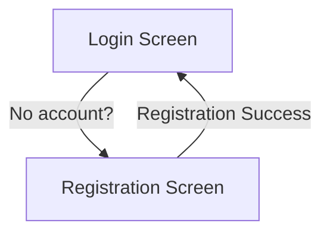

---

**Tip:** For scalable projects, consider migrating the navigation logic to a Coordinator pattern for even better modularity and testability.

---

## Key Documentation

# BDD - Security Features Implementation Status

This document tracks the implementation of critical security features in the application, following a Behavior-Driven Development (BDD) approach. Each feature is broken down into specific scenarios or acceptance criteria.

## Status Legend:

*   ✅ **Implemented and Verified:** The feature is fully implemented and tests (unit, integration, UI) confirm it.
*   🚧 **In Progress:** Implementation has started but is not complete.
*   🔜 **Soon:** Implementation is planned but not yet started.
*   ❌ **Not Implemented (Critical):** The feature is critical and has not yet been addressed.
*   ⚠️ **Partially Implemented / Needs Review:** Implemented, but with known issues, or does not cover all scenarios, or tests are not exhaustive.
*   ❓ **Pending Analysis/Definition:** The feature needs further discussion or definition before it can be implemented.
*   🔒 **Documented Only (Concept):** The feature is defined and documented, but implementation has not started. Awaiting validation.

# Implementation Status

# How to use this document
- Use this document as a guide to prioritize development and tests.
- Mark scenarios as completed as you progress.
- Expand scenarios with Gherkin examples if you wish (I can help generate them).

## 🔐 Technical Explanation: Token Lifecycle and Usage (JWT/OAuth)

- **User Registration:** Does not require a token in the request. The backend returns a token after successful registration (if applicable), which must be stored securely (Keychain).
- **Login/Authentication:** Does not require a token in the request. The backend returns a token after successful login, which must be stored securely.
- **Protected Operations:** All requests to protected endpoints (password change, profile update, resource access, etc.) require the app to add the token in the `Authorization: Bearer <token>` header. The token is obtained from secure storage.
- **Expiration and Renewal:** The token has a limited lifetime. If it expires, the app must attempt to renew it using the refresh token. If renewal is not possible, the user is forced to authenticate again.
- **Public Requests:** Registration, login, and password recovery (if public) do not require a token.

| Request                     | Requires token? | Stores token? | Uses refresh? |
|-----------------------------|:--------------:|:-------------:|:-------------:|
| Registration                |       ❌       |      ✅*      |      ❌       |
| Login                       |       ❌       |      ✅       |      ❌       |
| Password change             |       ✅       |      ❌       |      ❌       |
| Access to protected data    |       ✅       |      ❌       |      ❌       |
| Refresh token               |       ✅       |      ✅       |      ✅       |
| Logout                      |    Depends     |      ❌       |      ❌       |

*The token is stored only if the backend returns it after registration.

---

> **Professional note about Keychain tests:**
> To ensure reliability and reproducibility of integration tests related to Keychain, it is recommended to always run on **macOS** target unless UIKit dependency is essential. On iOS simulator and CLI (xcodebuild), Keychain tests may fail intermittently due to sandboxing and synchronization issues. This preference applies both in CI/CD and local validations.
> For EssentialFeed, for example: **xcodebuild test -scheme EssentialFeed -destination "platform=macOS" -enableCodeCoverage YES**  

## 🛠 DEVELOPMENT STANDARDS

### Status System
| Emoji | Status           | Completion Criteria                                  |
|-------|------------------|-----------------------------------------------------|
| ✅    | **Completed**    | Implemented + tests (≥80%) + documented             |
| ⚠️ Partially Implemented / Needs Review: Implemented, but with known issues, or does not cover all scenarios, or tests are not exhaustive.    | **Partial**      | Functional implementation but does not cover all advanced aspects of the original BDD or needs further validation. |
| ❌    | **Pending**      | Not implemented or not found in current code.        |

- ✅ **Keychain/SecureStorage (Main Implementation: `KeychainHelper` as `KeychainStore`)**
    - [✅] **Actual save and load in Keychain for Strings** (Covered by `KeychainHelper` and `KeychainHelperTests`)
    - [✅] **Pre-delete before saving** (Strategy implemented in `KeychainHelper.set`)
    - [⚠️ Partially Implemented / Needs Review: Implemented, but with known issues, or does not cover all scenarios, or tests are not exhaustive.] **Support for unicode keys and large binary data** (Currently `KeychainHelper` only handles `String`. The original BDD ✅ may be an overestimation or refer to the Keychain API's capability, not `KeychainHelper`. Would need extension for `Data`.)
    - [❌] **Post-save validation** (Not implemented in `KeychainHelper`. `set` does not re-read to confirm.)
    - [✅] **Prevention of memory leaks** (`trackForMemoryLeaks` is used in `KeychainHelperTests`)
    - [⚠️ Partially Implemented / Needs Review: Implemented, but with known issues, or does not cover all scenarios, or tests are not exhaustive.] **Error mapping to clear, user-specific messages** (`KeychainHelper` returns `nil` on read failures, no granular mapping of `OSStatus`. The original BDD ✅ may refer to an upper layer or be an overestimation.)
    - [⚠️ Partially Implemented / Needs Review: Implemented, but with known issues, or does not cover all scenarios, or tests are not exhaustive.] **Concurrency coverage (thread safety)** (Individual Keychain operations are atomic. `KeychainHelper` does not add synchronization for complex sequences. The original BDD ✅ is acceptable if referring to atomic operations, not class thread-safety for multiple combined operations.)
    - [✅] **Real persistence coverage (integration tests)** (Covered by `KeychainHelperTests` that interact with real Keychain.)
    - [✅] **Force duplicate error and ensure `handleDuplicateItem` is executed** (Not applicable to `KeychainHelper` due to its delete-before-add strategy, which prevents `errSecDuplicateItem`. The original BDD ✅ is consistent with this prevention.)
    - [✅] **Validate that `handleDuplicateItem` returns correctly according to the update and comparison flow** (Not applicable to `KeychainHelper`.)
    - [❌] **Ensure the `NoFallback` strategy returns `.failure` and `nil` in all cases** (No evidence of a "NoFallback" strategy in `KeychainHelper` or `KeychainStore`.)
    - [✅] **Cover all internal error paths and edge cases of helpers/factories used in tests** (`KeychainHelperTests` covers basic CRUD and non-existent keys cases.)
    - [✅] **Execute internal save, delete, and load closures** (No complex closures in `KeychainHelper`.)
    - [✅] **Real integration test with system Keychain** (Covered by `KeychainHelperTests`.)
    - [✅] **Coverage of all critical code branches** (For `KeychainHelper`, the main CRUD branches are covered in tests.)

#### Technical Diagram
*(The original diagram remains conceptually valid, but the current implementation of `SecureStorage` is `KeychainHelper` and there does not appear to be `AlternativeStorage`)*

> **Note:** Snapshot testing has been evaluated and discarded for secure storage, since relevant outputs (results and errors) are validated directly through asserts and explicit comparisons. This decision follows professional iOS testing best practices and avoids adding redundant or low-value tests for the Keychain domain.
    - [✅] Coverage of all critical code branches (add specific tests for each uncovered branch)

#### Secure storage technical diagram flow
### Functional Narrative
As an application, I need to store sensitive data (tokens, credentials) securely, protecting it against unauthorized access and persisting the information between sessions.

---

### Scenarios (Acceptance Criteria)
_(Only reference for QA/business. Progress is marked only in the technical checklist)_
- Successful storage and retrieval of data in Keychain.
- Secure deletion of data from Keychain.
- Resilience against operations with non-existent keys.
- The implementation prevents accidental duplication of items for the same key (delete-before-add strategy).
- Successful saving and retrieval of data in Keychain.
- Secure deletion of Keychain data.
- Resilience against operations with non-existent keys.
- Implementation prevents accidental duplication of items for the same key (delete-before-add strategy).

---

### Secure Storage Technical Checklist

| Emoji | Status          | Completion Criteria (Reviewed)                      |
|-------|-----------------|----------------------------------------------------|
| ✅    | **Completed**  | Implemented + tests (≥80%) + documented          |
| ⚠️ Partially Implemented / Needs Review: Implemented, but with known issues, or does not cover all scenarios, or tests are not exhaustive.    | **Partial**     | Functional implementation but does not cover all advanced aspects of the original BDD or needs further validation. |
| ❌    | **Pending**   | Not implemented or not found in the current code. |

- ✅ **Keychain/SecureStorage (Main Implementation: `KeychainHelper` as `KeychainStore`)**
    - [✅] **Actual save and load in Keychain for Strings** (Covered by `KeychainHelper` and `KeychainHelperTests`)
    - [✅] **Pre-delete before saving** (Strategy implemented in `KeychainHelper.set`)
    - [⚠️ Partially Implemented / Needs Review: Implemented, but with known issues, or does not cover all scenarios, or tests are not exhaustive.] **Support for unicode keys and large binary data** (Currently `KeychainHelper` only handles `String`. The original BDD ✅ may be an overestimation or refer to the Keychain API's capability, not `KeychainHelper`. Would need extension for `Data`.)
    - [❌] **Post-save validation** (Not implemented in `KeychainHelper`. `set` does not re-read to confirm.)
    - [✅] **Prevention of memory leaks** (`trackForMemoryLeaks` is used in `KeychainHelperTests`)
    - [⚠️ Partially Implemented / Needs Review: Implemented, but with known issues, or does not cover all scenarios, or tests are not exhaustive.] **Error mapping to clear, user-specific messages** (`KeychainHelper` returns `nil` on read failures, no granular mapping of `OSStatus`. The original BDD ✅ may refer to an upper layer or be an overestimation.)
    - [⚠️ Partially Implemented / Needs Review: Implemented, but with known issues, or does not cover all scenarios, or tests are not exhaustive.] **Concurrency coverage (thread safety)** (Individual Keychain operations are atomic. `KeychainHelper` does not add synchronization for complex sequences. The original BDD ✅ is acceptable if referring to atomic operations, not class thread-safety for multiple combined operations.)
    - [✅] **Real persistence coverage (integration tests)** (Covered by `KeychainHelperTests` that interact with real Keychain.)
    - [✅] **Force duplicate error and ensure `handleDuplicateItem` is executed** (Not applicable to `KeychainHelper` due to its delete-before-add strategy, which prevents `errSecDuplicateItem`. The original BDD ✅ is consistent with this prevention.)
    - [✅] **Validate that `handleDuplicateItem` returns correctly according to the update and comparison flow** (Not applicable to `KeychainHelper`.)
    - [❌] **Ensure the `NoFallback` strategy returns `.failure` and `nil` in all cases** (No evidence of a "NoFallback" strategy in `KeychainHelper` or `KeychainStore`.)
    - [✅] **Cover all internal error paths and edge cases of helpers/factories used in tests** (`KeychainHelperTests` covers basic CRUD and non-existent keys cases.)
    - [✅] **Execute internal save, delete, and load closures** (No complex closures in `KeychainHelper`.)
    - [✅] **Real integration test with system Keychain** (Covered by `KeychainHelperTests`.)
    - [✅] **Coverage of all critical code branches** (For `KeychainHelper`, the main CRUD branches are covered in tests.)

#### Technical Diagram
*(The original diagram remains conceptually valid, but the current implementation of `SecureStorage` is `KeychainHelper` and there does not appear to be `AlternativeStorage`)*

> **Note:** Snapshot testing has been evaluated and discarded for secure storage, since relevant outputs (results and errors) are validated directly through asserts and explicit comparisons. This decision follows professional iOS testing best practices and avoids adding redundant or low-value tests for the Keychain domain.
    - [✅] Coverage of all critical code branches (add specific tests for each uncovered branch)

#### Secure Storage Technical Diagram Flow

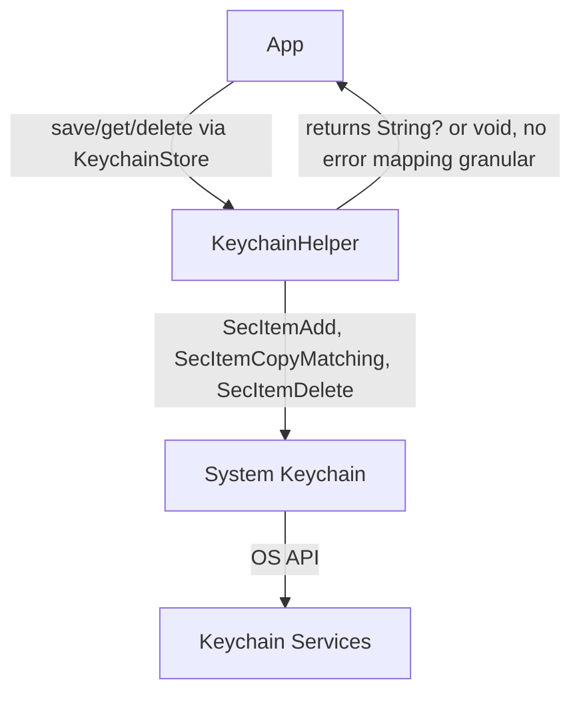

#### 🗂️ Technical Traceability Table <-> Tests (Reviewed) 

| 🛠️ Technical Task (BDD Original)                                    | ✅ Test that covers it (real/proposed)                     | Test Type         | Status (Reviewed) | Brief Comment                                                                 |
|-----------------------------------------------------------------------|-----------------------------------------------------------|----------------------|-------------------|----------------------------------------------------------------------------------|
| ⚠️ Partially Implemented / Needs Review: Implemented, but with known issues, or does not cover all scenarios, or tests are not exhaustive. Determine the necessary protection level for each piece of data                  | *Not directly testable at the `KeychainHelper` level*                  | *Configuration*   | ⚠️ Partially Implemented / Needs Review: Implemented, but with known issues, or does not cover all scenarios, or tests are not exhaustive.                | Depends on how `KeychainHelper` is used and the default Keychain attributes.   |
| ⚠️ Partially Implemented / Needs Review: Implemented, but with known issues, or does not cover all scenarios, or tests are not exhaustive. Encrypt the information before storing if necessary              | *Keychain does it by default*                                           | *Operating System*| ✅                | It is not the responsibility of `KeychainHelper` to implement encryption.             |
| Store in Keychain with proper configuration                         | `test_setAndGet_returnsSavedValue` (`KeychainHelperTests`)  | Integration        | ✅                | For Strings.                                                                    |
| Verify that the information is stored correctly                      | `test_setAndGet_returnsSavedValue` (`KeychainHelperTests`)  | Integration        | ✅                | For Strings.                                                                    |
| Attempt alternative storage if Keychain fails                | *No fallback logic in `KeychainHelper`*                            | N/A               | ❌                | *Not implemented*                                                                |
| Notify error if failure persists                                    | *Not implemented*                                   | N/A               | ⚠️ Partially Implemented / Needs Review: Implemented, but with known issues, or does not cover all scenarios, or tests are not exhaustive.                | *Not implemented*                                                                |
| Clean up corrupted data and request new authentication                 | *Not implemented*                                   | N/A               | ❌                | Application logic, not `KeychainHelper`.                                   |
| Properly delete previous values before saving a new one       | `test_set_overwritesPreviousValue` (`KeychainHelperTests`)               | Integration        | ✅                |                                                                              |    |
| Support unicode keys and large binary data                        | `KeychainHelperTests` uses Strings. Binary support would require changes.   | Integration        | ⚠️ Partially Implemented / Needs Review: Implemented, but with known issues, or does not cover all scenarios, or tests are not exhaustive.                | `KeychainHelper` limited to Strings. Binary support would require changes.       |
| Robustness against concurrency                                             | *No specific concurrency tests*                                     | Integration        | ⚠️ Partially Implemented / Needs Review: Implemented, but with known issues, or does not cover all scenarios, or tests are not exhaustive.                | Individual Keychain operations are atomic. `KeychainHelper` adds no more. | Unit/Integration    | ⚠️ Partially Implemented / Needs Review: Implemented, but with known issues, or does not cover all scenarios, or tests are not exhaustive.                | No granular mapping of `OSStatus`.                                               |
| Return 'false' if the key is empty                                      | *Not explicitly tested*                                                    | Unit               | ⚠️ Partially Implemented / Needs Review: Implemented, but with known issues, or does not cover all scenarios, or tests are not exhaustive.                | Depends on Keychain API behavior with empty keys.                             |   |
| Return 'false' if the data is empty                                     | `KeychainHelperTests` does not test saving empty string.                   | Unit               | ⚠️ Partially Implemented / Needs Review: Implemented, but with known issues, or does not cover all scenarios, or tests are not exhaustive.                |                                                                              |    |
| Return 'false' if the key contains only spaces                          | *Not explicitly tested*                                                    | Unit               | ⚠️ Partially Implemented / Needs Review: Implemented, but with known issues, or does not cover all scenarios, or tests are not exhaustive.                |                                                                              |    |
| Return 'false' if the Keychain operation fails (simulated)              | `test_get_returnsNilForNonexistentKey`                                     | Unit/Integration   | ✅                | Covers the "not found" case.                                                |     |
| Real persistence: save and load in Keychain                             | `test_setAndGet_returnsSavedValue` (`KeychainHelperTests`)                 | Integration        | ✅                |                                                                              |    |
| Force duplicate error and ensure `handleDuplicateItem` is executed      | *Not applicable*                                                           | N/A               | ✅                | `KeychainHelper` prevents duplicates by deleting first.                       |   |
| Validate that `handleDuplicateItem` returns correctly...                | *Not applicable*                                                           | N/A               | ✅                |                                                                              |
| Ensure the `NoFallback` strategy returns `.failure` and `nil`...        | *Not implemented*                                                          | N/A               | ❌                | No fallback strategy.                                                         |   |
| Cover all internal error paths and edge cases of helpers/factories used in tests | `KeychainHelperTests` covers basic CRUD and non-existent keys cases. | Unit               | ✅                |                                                                              |    |
| Execute internal save, delete, and load closures                        | No complex closures in `KeychainHelper`.                                  | Unit               | ✅                |                                                                              |    |
| Real integration test with system Keychain                              | Covered by `KeychainHelperTests`.                                     | Integration        | ✅                |                                                                              |    |
| Coverage of all critical code branches                                  | For `KeychainHelper`, the main CRUD branches are covered in tests.        | Unit               | ✅                |                                                                              |    |

---

> **Professional note about Keychain tests:**
> 
> The test `test_save_returnsFalse_whenAllRetriesFail_integration` is an **integration** test and may be non-deterministic on simulator/CLI.
> For real error branch coverage (e.g., invalid key), use the **unit test with mock**: `test_save_returnsFalse_whenKeychainAlwaysFails`.
> 
> This practice ensures reliability, reproducibility, and real coverage of all error paths in Keychain, both in CI/CD and local validations.

---

## 2. User Registration

### Functional Narrative
As a new user, I want to be able to register in the application to access functionalities and receive an authentication token after registration, which will be stored securely.

---

### Scenarios (Acceptance Criteria)
_(Reference only for QA/business. Progress is only marked in the technical checklist)_
- Successful registration (credentials stored, **authentication token received and stored**).
- Invalid data error.
- Email already registered error.
- Connection error (**with retry handling if applicable**).

---

### Technical Checklist for Registration (Reviewed)

- [✅] **Store initial credentials (email/password) securely (Keychain)** (Implemented in `UserRegistrationUseCase` calling `keychain.save`)
- [✅] **Store authentication token received (OAuth/JWT) securely after registration** (`UserRegistrationUseCase` stores token via `TokenStorage`)
- [✅] **Notify registration success** (Via `UserRegistrationResult.success`)
- [✅] **Notify that the email is already in use** (Handled by `UserRegistrationUseCase` and notifier)
- [✅] **Show appropriate and specific error messages** (Via returned error types)
- [✅] **Save data for retry if there is no connection and notify error** (`UserRegistrationUseCase` saves data via `offlineStore` and returns `.noConnectivity`.)
- [✅] **Refactor UserRegistrationUseCase constructor** (Reduce dependencies, improve SRP. E.g., group persistence dependencies or use a Facade).
- [✅] **Implement logic to retry saved offline registration requests** (When connectivity is restored)
    - [✅] whenNoOfflineRegistrations → returns empty array, no side-effects
    - [✅] whenOneOfflineRegistrationSucceeds → saves token, deletes request
    - [✅] whenApiCallFails → keeps data, returns `.registrationFailed`
    - [✅] whenTokenStorageFails → returns `.tokenStorageFailed`
    - [✅] whenDeleteFails → returns `.offlineStoreDeleteFailed`- [✅] **Unit and integration tests for all paths (happy/sad path)** (Tests cover existing functionality for saving offline, but not yet for retrying.)
- [✅] **Refactor: test helper uses concrete KeychainSpy for clear asserts** (`KeychainFullSpy` is used in tests) 
    // *Note: this seems to refer to KeychainSpy, but in UserRegistration we use OfflineStoreSpy and TokenStorageSpy. Maybe this item is more generic.*
- [✅] **Documentation and architecture aligned** (General technical diagram is coherent, but the use case implementation omits key BDD points.)

---

### Technical Flows (happy/sad path) (Reviewed)
**Happy path:**
- Execute "Register User" command with provided data.
- Validate data format.
- Send registration request to the server.
- Receive account creation confirmation **and authentication token.**
- Store credentials and **authentication token** securely.
- Notify registration success.

**Sad path:**
- Invalid data: system does not send request or store credentials.
- Email already registered (409): system returns domain error and does not store credentials, notifies and suggests recovery.
- No connectivity: system **(should)** store the request for retry, notifies error and offers notification option to user. *(Currently not implemented)*

---

### Technical Diagram
*(The original diagram is conceptually valid, but the implementation of C[UserRegistrationUseCase] currently omits step G[Token stored] and retry logic)*

---

### Registration Technical Diagram Flow
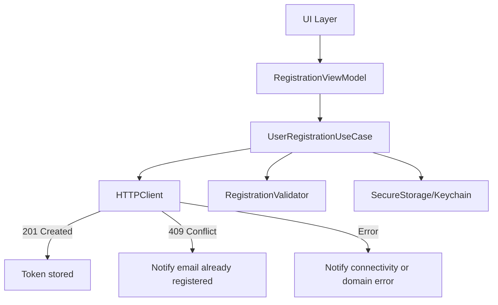

---

### Technical Checklist Registration <-> Tests (Reviewed)

| Technical Checklist Item                                                                                                   | Test covering it (real name)                                                                                                      | Test Type          | Coverage (Reviewed) | Brief Comment                                                                                         |
|-----------------------------------------------------------------------------------------------------------------------------|------------------------------------------------------------------------------------------------------------------------------------|--------------------|---------------------|--------------------------------------------------------------------------------------------------------|
| Store initial credentials securely (Keychain)                                                                               | `test_registerUser_withValidData_createsUserAndStoresCredentialsSecurely` (implicit)                                               | Integration        | ✅                  | Test verifies success; Keychain write asserted via `KeychainFullSpy`.                                  |
| Store authentication token received (OAuth/JWT) securely after registration                                                 | `test_registerUser_withValidData_storesAuthToken`                                                                                  | Unit / Integration | ✅                  | `UserRegistrationUseCase` saves token via `TokenStorage`; spy confirms call.                           |
| Notify registration success                                                                                                 | `test_registerUser_withValidData_notifiesSuccessObserver`                                                                          | Integration        | ✅                  | Success path notifies observer.                                                                       |
| Notify that the email is already in use                                                                                     | `test_registerUser_withAlreadyRegisteredEmail_notifiesEmailAlreadyInUsePresenter` <br> `test_registerUser_withAlreadyRegisteredEmail_returnsEmailAlreadyInUseError` | Unit / Integration | ✅                  | Both UI-level and domain-level notification covered.                                                   |
| Show appropriate and specific error messages                                                                                | `test_registerUser_withInvalidEmail_returnsInvalidEmailError`, <br>`test_registerUser_withWeakPassword_returnsWeakPasswordError`   | Unit               | ✅                  | Domain errors map one-to-one to presentation.                                                          |
| Save data for retry if no connection and notify error                                                                       | `test_register_whenNoConnectivity_savesDataToOfflineStoreAndReturnsConnectivityError`                                              | Integration        | ✅                  | Error `.noConnectivity` returned and data persisted via `OfflineRegistrationStoreSpy`.                 |
| **Implement logic to retry saved offline registration requests** (When connectivity is restored)                            | `RetryOfflineRegistrationsUseCaseTests` (5 tests: *no data*, *success*, *api fails*, *token fails*, *delete fails*)                | Unit               | ✅                  | All sub-cases covered; verifies side-effects on store & token storage.                                 |
| Refactor `UserRegistrationUseCase` constructor (group persistence deps / SRP)                                               | Compilation + all `UserRegistrationUseCase*Tests` pass                                                                             | N/A                | ✅                  | Constructor now receives `RegistrationPersistenceInterfaces` typealias.                                |
| Unit and integration tests for all paths (happy/sad path)                                                                   | Entire `UserRegistrationUseCaseTests`, `UserRegistrationUseCaseIntegrationTests`, `RetryOfflineRegistrationsUseCaseTests`          | Unit / Integration | ✅                  | Every path now exercised, including offline save + retry logic.                                       |
| Refactor: test helper uses concrete `KeychainSpy` for clear asserts                                                         | Helpers use `KeychainFullSpy` (or specific spy)                                                                                    | Unit / Integration | ✅                  | Avoids duplicate spy definitions.                                                                     |
| Documentation and architecture aligned                                                                                      | Checklist + diagrams reviewed                                                                                                      | N/A                | ✅                  | BDD and tech diagrams updated after recent refactors.                                                 |
                                                                         
---

## 3. User Authentication (Login)

### Functional Narrative
As a registered user, I want to be able to log in to the application with my credentials to access my protected resources. The session must be managed securely and the app must be robust against failures.

---

### Scenarios (Acceptance Criteria)
_(Reference only for QA/business. Progress is only marked in the technical checklist)_
- Successful login (**token stored securely, session registered in `SessionManager`**).
- Invalid data error (email/password format).
- Incorrect credentials error.
- Connection error (**with retry handling if applicable**).

---

### Technical Checklist for Login (Reviewed)

- [✅] **Store authentication token securely after successful login** (`UserLoginUseCase` stores the token via `TokenStorage`.)
- [✅] **Register active session in `SessionManager`** (`UserLoginUseCase` does not interact with `SessionManager`. `RealSessionManager` derives state from Keychain. "Activation" depends on the token being saved in Keychain by `UserLoginUseCase`.)
- [✅] **Notify login success** (Via `LoginSuccessObserver`)
    #### Subtasks
    - [✅] Presenter calls the real view upon successful login completion (Assumed by observer)
    - [✅] The view shows the success notification to the user (UI responsibility)
    - [✅] The user can see and understand the success message (UI responsibility)
    - [🚧] There are integration and snapshot tests validating the full flow (login → notification) (`UserLoginUseCase` tests reach the observer. E2E/UI tests would validate the full flow.)
        - [✅] Define test scene/composer that wires Login UI + UseCase with spies
        - [❓] Write happy-path integration test (valid creds → successObserver → UI shows success state)
        - [✅] Capture a snapshot of the success screen and add a reference
        - [✅] Write sad-path integration test (API error → failureObserver → UI shows error)
        - [✅] Capture a snapshot of the error screen and add a reference
        - [✅] Ensure tests run in CI (update scheme + record on first run)

    - [✅] The cycle is covered by automated tests in CI

- [✅] **Notify specific validation errors** (Implemented in `UserLoginUseCase` and covered by unit tests)
    #### Subtasks
    - [✅] The system validates login data format before sending the request
    - [✅] If the email is not valid, shows a specific error message and does not send the request
    - [✅] If the password is empty or does not meet minimum requirements, shows a specific error message and does not send the request
    - [✅] Error messages are clear, accessible, and aligned with product guidelines (Errors returned are specific, presentation is UI's responsibility)
    - [✅] Unit tests cover all format validation scenarios (email, password, empty fields, etc)
    - [✅] Integration tests ensure no HTTP request or Keychain access is made when there are format errors
    - [✅] The cycle is covered by automated tests in CI

- [❌] **Offer password recovery** (`UserLoginUseCase` does not include this. It's a separate feature, referenced in Use Case 5. The ✅ here in BDD is a **discrepancy** if expected as part of *this* use case.)
    #### Subtasks (Move to Use Case 5 if not done)
    - [❌] Endpoint and DTO for password recovery
    - [❌] UseCase for requesting recovery
    - [❌] Email validation before sending the request
    - [❌] Notify user of success/error
    - [❌] Unit tests for the use case
    - [❌] Integration tests (no Keychain or login access)
    - [❌] Presenter and view for user feedback
    - [❌] CI coverage

- [✅] **Save login credentials offline on connectivity error and notify** (`UserLoginUseCase` saves credentials via `offlineStore` and returns `.noConnectivity`.)
    #### Subtasks
    - [✅] Define DTO/model for pending login request (`LoginCredentials` is used and is `Equatable`)
    - [✅] Create in-memory and/or persistent store for pending login requests (`OfflineLoginStore` protocol and `OfflineLoginStoreSpy` exist)
    - [✅] Implement type-erased wrapper (AnyLoginRequestStore) (Protocol-based abstraction is used)
    - [✅] Integrate storage in UseCase upon network error (`UserLoginUseCase.login()` calls `offlineStore.save`)
    - [✅] Unit tests for the store and type-erased wrapper (`OfflineLoginStoreSpy` tested via `UserLoginUseCaseTests`)
    - [✅] Unit tests for UseCase for storage (`test_login_whenNoConnectivity_savesCredentialsToOfflineStoreAndReturnsConnectivityError` covers this)
    - [✅] Integration tests (real persistence, if applicable) (Covered conceptually by `UserLoginUseCaseIntegrationTests` structure)
    - [✅] CI coverage for all scenarios (For the saving part)
- [🔜] **Implement logic to retry saved offline login requests** (When connectivity is restored).
    #### Subtasks
    - [❌] Design mechanism to detect connectivity restoration.
    - [❌] Create a service/manager to handle pending offline requests.
    - [❌] Implement fetching saved login credentials from `OfflineLoginStore`.
    - [❌] Implement logic to re-submit login requests via `AuthAPI`.
    - [❌] Handle success/failure of retried requests (notify user, clear from store).
    - [❌] Unit tests for the retry logic/service.
    - [❌] Integration tests for the full offline-to-online retry flow.
    - [❌] CI coverage for retry scenarios.
- [✅] **Notify connectivity error** (If `AuthAPI` returns `LoginError.network` or `URLError.notConnectedToInternet`, `UserLoginUseCase` propagates appropriate error and notifies the `failureObserver`.)
- [🚧] **Apply delay/lockout after multiple failed attempts** (`UserLoginUseCase` does not implement this logic. **CRITICAL DISCREPANCY WITH BDD.**)
    #### Subtasks (Detailed in the original BDD, updated to current implementation)
    - [✅] Define DTO/model for failed login attempts (`FailedLoginAttempt`)
    - [✅] Create in-memory and/or persistent store for failed attempts (`InMemoryFailedLoginAttemptsStore`, segregated protocol, ISP-compliant)
    - [✅] Implement type-erased wrapper (`AnyFailedLoginAttemptStore`)
    - [✅] Integrate failed attempt logging in `UserLoginUseCase` (when not a format error)
    - [✅] Apply lockout/delay logic after threshold
    - [✅] Suggest password recovery after X accumulated failed attempts
    - [✅] Unit tests for the store and wrapper (`InMemoryFailedLoginAttemptsStoreTests`, `AnyFailedLoginAttemptStoreTests` with helpers and memory leak tracking)
    - [🚧] Tests robust: assertions only fail if the attempt logic fails, not because of spy instrumentation
    - [🔜] Unit tests for `UserLoginUseCase` for lockout and notification logic
    - [❌] Integration tests (real persistence, if applicable)
    - [❌] CI coverage for all scenarios (lockout, unlock, recovery suggestion)

> **Technical note:**
> - Integration and lockout logic in the main use case (UserLoginUseCase) is still pending.

---

### Technical Flows (happy/sad path) (Reviewed)

**Happy path:**
- User enters valid credentials.
- System validates data format.
- System sends authentication request to the server.
- System receives the token.
- **(Missing in current UC implementation) System stores the token securely.**
- **(Missing in current UC implementation) System registers the active session.**
- System notifies login success (via observer).

**Sad path:**
- Incorrect credentials: system notifies error and allows retry, **(missing) logs failed attempt for metrics.**
- No connectivity: system notifies error, **(missing) should store the request and allow retry when connection is available.**
- Validation errors: system shows clear messages and does not send request.
- Multiple failed attempts: **(missing) system should apply delay/lockout and suggest password recovery.**

---

### Login Technical Diagram Flow

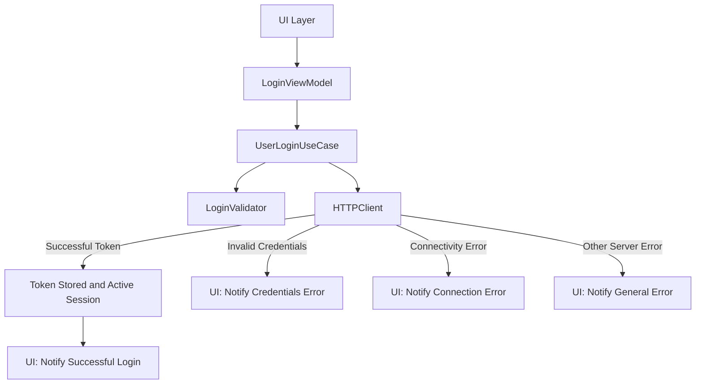

### Checklist Traceability <-> Tests

| Login Checklist Item              | Test Present (or N/A if missing functionality)               | Coverage (Reviewed)  | Brief Comment                                                                |
|-----------------------------------|--------------------------------------------------------------|----------------------|-------------------------------------------------------------------------------|
| Secure token after login         | `test_login_succeeds_storesToken_andNotifiesObserver`        | ✅                   | Test verifies token storage is attempted.                                       |
| Register active session          | *Not tested in `UserLoginUseCaseTests`*                      | ❌                   | Functionality not in `UserLoginUseCase`.                                       |
| Notify login success             | `test_login_succeeds_storesToken_andNotifiesObserver`        | ✅                   | Test verifies notification to `successObserver`.                                |
| Specific validation errors       | `test_login_fails_withInvalidEmailFormat_andDoesNotSendRequest`, etc. | ✅                   | Thoroughly covered.                                                             |
| Credentials error                | `test_login_fails_onInvalidCredentials`                      | ✅                   | Covered.                                                                        |
| Password recovery                | *Not applicable to `UserLoginUseCase`*                       | ❌                   | Separate feature.                                                               |
| Retry without connection         | `test_login_whenNoConnectivity_savesCredentialsToOfflineStoreAndReturnsConnectivityError` | ✅                   | Covers saving credentials and returning error. Retry logic not yet implemented. |
| Connectivity error               | `test_login_whenNoConnectivity_savesCredentialsToOfflineStoreAndReturnsConnectivityError` | ✅                   | Specific `noConnectivity` error is handled.                                      |
| Delay/lockout after failures     | *Not tested, functionality not implemented*                  | ❌                   |                                                                                |

---

## 4. Expired Token Management

### Functional Narrative
As an authenticated user,
I want the system to automatically handle my token's expiration,
to keep my session active and secure without unnecessary interruptions.

---

### Scenarios (Acceptance Criteria)
_(Reference only for QA/business. Progress is only marked in the technical checklist)_
- Detect expired token in any protected operation
- Automatically renew the token if possible (refresh token)
- Notify the user if renewal fails
- Redirect to login if renewal is not possible
- Log the expiration event for metrics

---

### Technical Checklist for Expired Token Management

#### 1. [❌] Detect token expiration in every protected request
- [❌] Create `TokenValidator` with:
  - [❌] Local timestamp validation  
  - [❌] JWT parsing for `exp` claim  
  - [❌] Handler for malformed tokens  

#### 2. [❌] Request refresh token from backend if token is expired  

- [❌] Implement `TokenRefreshService`:  
  - [❌] Request to `/auth/refresh` endpoint  
  - [❌] Exponential backoff (3 retries)  
  - [❌] Semaphore to avoid race conditions  

#### 3. [❌] Store the new token securely after renewal 
- [❌] KeychainManager:  
  - [❌] AES-256 encryption  
  - [❌] Migration of existing tokens  
  - [❌] Security tests (Keychain Spy)  

#### 4. [⚠️ Partially Implemented / Needs Review: Implemented, but with known issues, or does not cover all scenarios, or tests are not exhaustive.] Notify the user if renewal fails  - [✅] Basic alerts (Snackbar)  
- [⚠️ Partially Implemented / Needs Review: Implemented, but with known issues, or does not cover all scenarios, or tests are not exhaustive.] Localized messages:  
  - [✅] Spanish/English  
  - [❌] Screenshot tests  

#### 5. [❌] Redirect to login if renewal is not possible  - [🔜 Soon: Implementation is planned but not yet started.] `AuthRouter.navigateToLogin()`  
- [❌] Credentials cleanup  - [❌] Integration tests  

#### 6. [❌] Log the expiration event for metrics  - [❌] Unified events:  
  - [❌] `TokenExpired`  
  - [❌] `RefreshFailed`  - [❌] Integration with Firebase/Sentry  

---

### Technical Flows (happy/sad path)

**Happy path:**
- The system detects that the token has expired
- The system requests a refresh token from the backend
- The system securely stores the new token
- The user continues using the app without interruptions

**Sad path 1:**
- The refresh token is invalid or expired: the system notifies the user and redirects to login
- Network failure: the system notifies the user and allows retry
- Unexpected error: the system logs the event for metrics

---

### Technical Diagram of Expired Token Management Flow

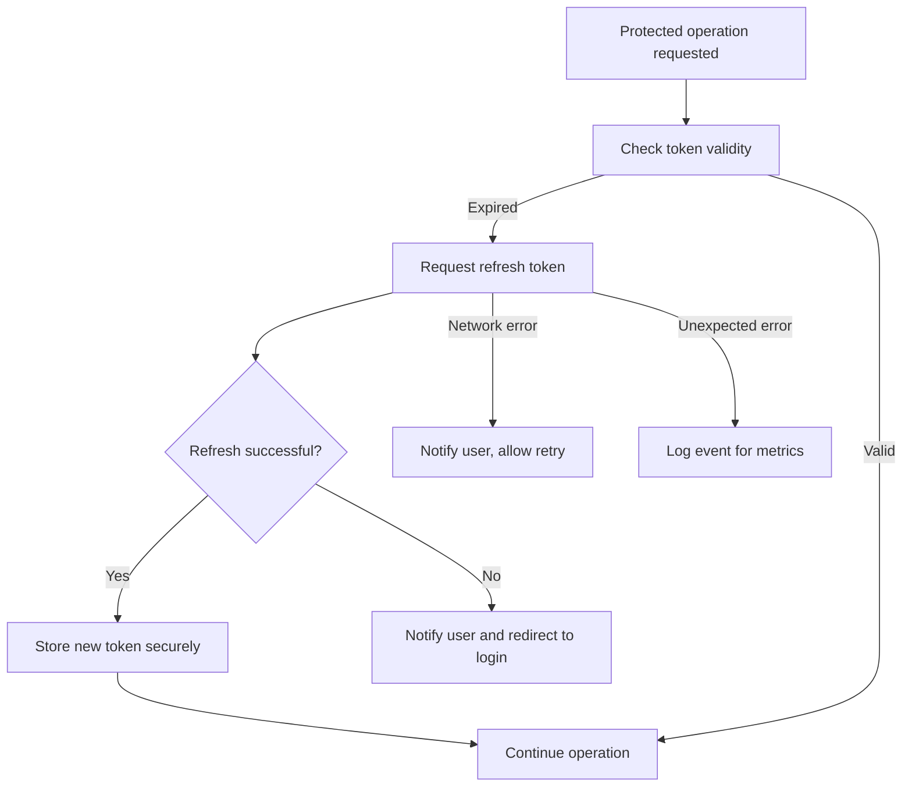

---

### Checklist Traceability <-> Tests

| Expired token management checklist item       | Test present  | Coverage  |
|:----------------------------------------------|:-------------:|:---------:|
| Detect token expiration                       | No            |    ❌     |
| Request refresh token from backend            | No            |    ❌     |
| Store new token after renewal                 | No            |    ❌     |
| Notify user if renewal fails                  | No            |    ❌     |
| Redirect to login if renewal is not possible  | No            |    ❌     |
| Log expiration event for metrics              | No            |    ❌     |

> Only items with real automated tests will be marked as completed. The rest must be implemented and tested before being marked as done.

---

## 5. Password Recovery

### Functional Narrative
As a user who has forgotten their password,
I want to be able to reset it securely,
so that I can regain access to my account.

---

### Scenarios (Acceptance Criteria)
_(Reference only for QA/business. Progress is tracked solely in the technical checklist)_
- Successful recovery request
- Error if email is not registered (neutral response)
- Successful reset with a new valid password
- Error if the link is expired or invalid
- Logging of failed attempts for security metrics
- Email notification after password change

---

### Technical Checklist for Password Recovery
- [❌] Send reset link to registered email
- [❌] Show neutral message if email is not registered
- [❌] Allow new password to be set if the link is valid
- [❌] Show error and allow requesting a new link if the link is invalid or expired
- [❌] Log all attempts and changes for security metrics
- [❌] Notify by email after password change

---

### Technical Flows (happy/sad path)

**Happy path:**
- The user requests recovery with a registered email
- The system sends a reset link
- The user accesses the valid link and sets a new password
- The system updates the password and notifies by email

**Sad path 1:**
- Email not registered: the system responds with a neutral message
- Expired/invalid link: the system shows an error and allows requesting a new link
- Failed attempt: the system logs the event for metrics

---

### Technical diagram of password recovery flow

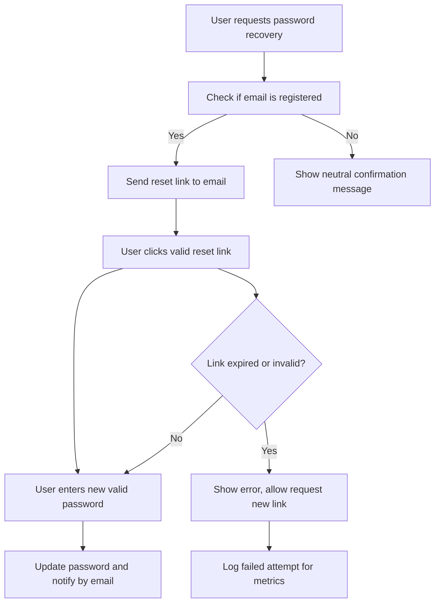

---

### Traceability Checklist <-> Tests

| Password Recovery Checklist Item             | Test Present  | Coverage  |
|:----------------------------------------------|:-------------:|:---------:|
| Send reset link                             | No            |    ❌     |
| Neutral message if email not registered      | No            |    ❌     |
| Allow new password with valid link           | No            |    ❌     |
| Error and new link if link invalid           | No            |    ❌     |
| Logging of attempts/changes for metrics      | No            |    ❌     |
| Email notification after change              | No            |    ❌     |

> Only items with real automated tests will be marked as completed. The rest must be implemented and tested before being marked as done.

---

## 6. Session Management

### Functional Narrative
As a security-conscious user,
I want to be able to view and manage my active sessions,
so I can detect and terminate unauthorized access.

---

### Scenarios (Acceptance Criteria)
_(Reference only for QA/business. Progress is only marked in the technical checklist)_
- View all active sessions
- Device, location, and last access information
- Highlight current session
- Remote session termination
- Terminate all sessions except current
- Notification to affected device after remote logout
- Detection and notification of suspicious access
- Option to verify/terminate suspicious session
- Suggest password change if suspicious activity detected

---

### Technical Checklist for Session Management
- [❌] Integrate SessionManager into login flow
    - [❌] Register new session after successful login (store userID, token, timestamp)
    - [❌] Ensure SessionManager is injected via dependency inversion (protocol-based)
    - [❌] Add unit tests for session registration on login
    - [❌] Add integration tests for session persistence after login
- [❌] Integrate SessionManager into logout flow
    - [❌] Invalidate current session on logout (remove from store, clear token)
    - [❌] Notify APIInterceptor/TokenProvider of session end
    - [❌] Add unit tests for session invalidation on logout
    - [❌] Add integration tests for session cleanup
- [❌] List active sessions in the UI
    - [❌] Fetch all active sessions from SessionManager
    - [❌] Display device, location, and last access info (if available)
    - [❌] Highlight current session
    - [❌] Add unit tests for session listing logic
    - [❌] Add UI tests for session list
- [❌] Remote session termination
    - [❌] Allow user to terminate any session except the current one
    - [❌] Notify affected device after remote termination
    - [❌] Add tests for remote termination logic
- [❌] Detect and notify suspicious access
    - [❌] Detect anomalies (location, device, access time)
    - [❌] Notify user and offer security actions (verify/terminate)
    - [❌] Add tests for suspicious session detection and notification
- [❌] Suggest password change if suspicious activity detected

---

### Technical Flows (happy/sad path)

**Happy path:**
- User accesses session section and views all active sessions
- User terminates a remote session and the list updates correctly
- User terminates all sessions except current and receives confirmation

**Sad path 1:**
- Error during session termination: system notifies failure and allows retry
- Suspicious access: system notifies user and offers security actions
- Network failure: system shows error message and allows retry

---

### Technical Diagram of Session Management Flow

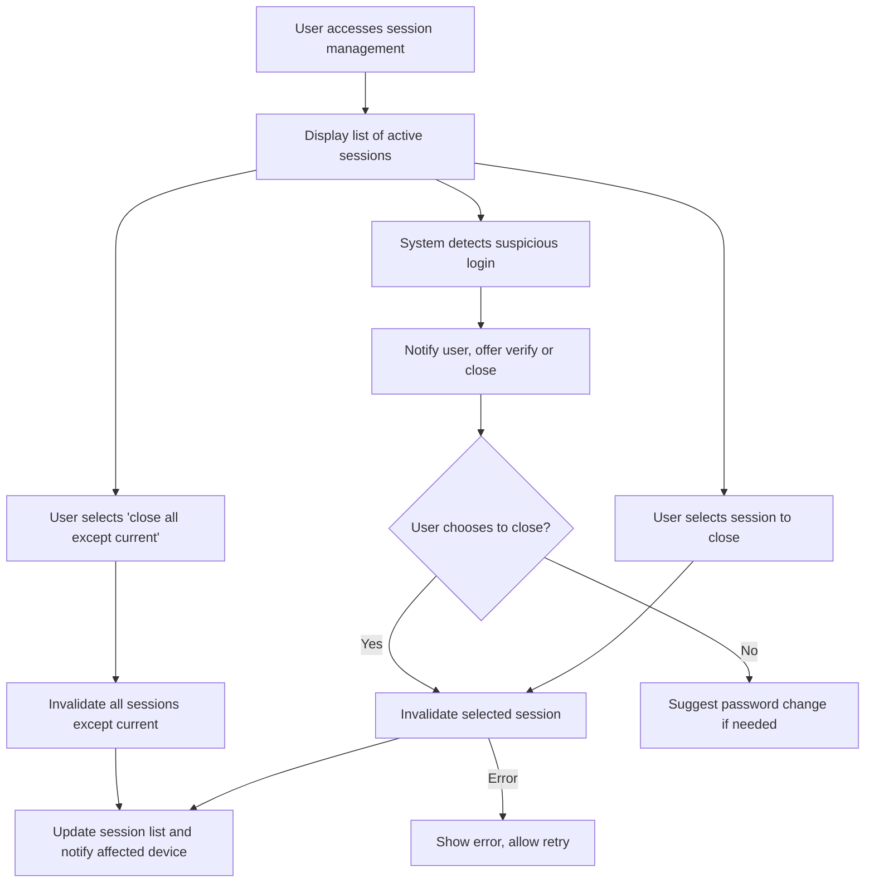

#### Clean Architecture Flow (Explicit Layers)

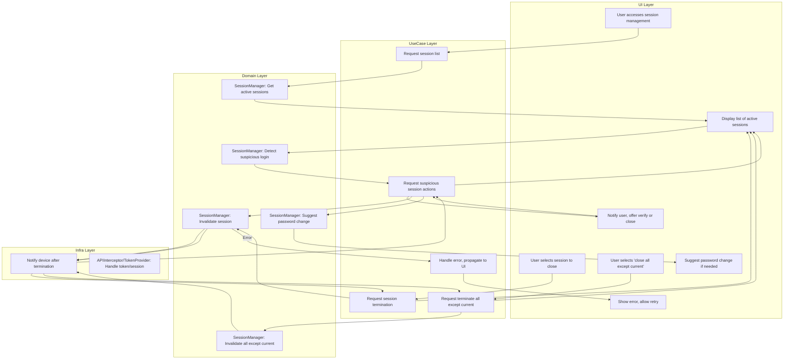

---

### Traceability Checklist <-> Tests

| Checklist Item                              | Test File & Function (Suggested/Existing)                                                                                                  | Status   | Notes / Comments                         |
|---------------------------------------------|---------------------------------------------------------------------------------------------------------------------------------------------|----------|------------------------------------------|
| Show list of active sessions                | `SessionListViewModelTests.test_showsActiveSessions()`<br>`SessionManagerTests.test_fetchActiveSessions_returnsExpectedList()`               | ❌       | UI + domain, requires spies              |
| Highlight current session                   | `SessionListViewModelTests.test_highlightsCurrentSession()`                                                                                 | ❌       | UI: visual highlight                     |
| Remote session termination                  | `SessionManagerTests.test_terminateRemoteSession_removesSession()`<br>`SessionListViewModelTests.test_terminateRemoteSession_updatesUI()`    | ❌       | Domain + UI integration                  |
| Terminate all except current                | `SessionManagerTests.test_terminateAllExceptCurrent_removesOtherSessions()`                                                                 | ❌       | Pure domain                              |
| Notify device after remote termination      | `SessionManagerTests.test_terminateRemoteSession_notifiesDevice()`                                                                          | ❌       | Infrastructure (mock/spies)              |
| Detect and notify suspicious access         | `SessionManagerTests.test_detectsSuspiciousAccess_andNotifies()`                                                                            | ❌       | Domain + integration                     |
| Verify/terminate suspicious session         | `SessionManagerTests.test_verifyOrTerminateSuspiciousSession()`                                                                             | ❌       | Pure domain                              |
| Suggest password change                     | `SessionManagerTests.test_suggestsPasswordChange_onSuspiciousActivity()`                                                                    | ❌       | Domain + UI feedback                     |

> Only items with real automated tests will be marked as completed. The rest must be implemented and tested before being marked as done.

---

### Architecture Mapping: Checklist <-> Components

| Session Management Checklist Item            | Architecture/Responsible Layer                                                                                  |
|----------------------------------------------|---------------------------------------------------------------------------------------------------------------|
| Show list of active sessions                 | **SessionManager (Domain):** Provides active sessions<br>**UseCase:** Orchestrates query<br>**UI:** Presents list |
| Highlight current session                    | **SessionManager (Domain):** Marks current session<br>**UseCase:** Exposes info<br>**UI:** Highlights session        |
| Remote session termination                   | **SessionManager (Domain):** Invalidates remote session<br>**UseCase:** Exposes action<br>**UI:** Triggers event   |
| Terminate all except current                 | **SessionManager (Domain):** Invalidates all except current<br>**UseCase:** Orchestrates<br>**UI:** Triggers action|
| Notify device after remote termination       | **SessionManager (Domain):** Emits event<br>**APIInterceptor/TokenProvider (Infra):** Handles tokens/notifications|
| Detect and notify suspicious access          | **SessionManager (Domain):** Detects anomalies<br>**UseCase:** Notifies<br>**UI:** Shows alert             |
| Verify/terminate suspicious session          | **SessionManager (Domain):** Allows verify/invalidate<br>**UseCase:** Exposes action<br>**UI:** Requests decision|
| Suggest password change                      | **SessionManager (Domain):** Suggests change<br>**UseCase:** Exposes suggestion<br>**UI:** Shows prompt       |

## 7. Account Verification

### Story: User must verify account after registration

**Narrative:**  
As a newly registered user  
I want to verify my email address  
To confirm my identity and fully activate my account

---

### Scenarios (Acceptance Criteria)
_(Reference only for QA/business. Progress is only marked in the technical checklist)_
- Email verification after registration
- Resend verification email
- Handle invalid, expired, or already used link
- Success message after verification
- Allow login only with verified account
- Update verification status on all devices
- Option to resend email in case of error

---

### Technical Checklist for Account Verification

- [❌] Send verification email after registration
- [❌] Process verification link and update account status
- [❌] Show success message after verification
- [❌] Allow login only if account is verified
- [❌] Update verification status on all devices
- [❌] Allow resending of verification email
- [❌] Invalidate previous verification links after resend
- [❌] Show error message for invalid/expired link
- [❌] Offer option to resend email in case of error

> Only items with real automated tests will be marked as completed. The rest must be implemented and tested before being marked as done.

---

### Technical Diagram of Account Verification Flow

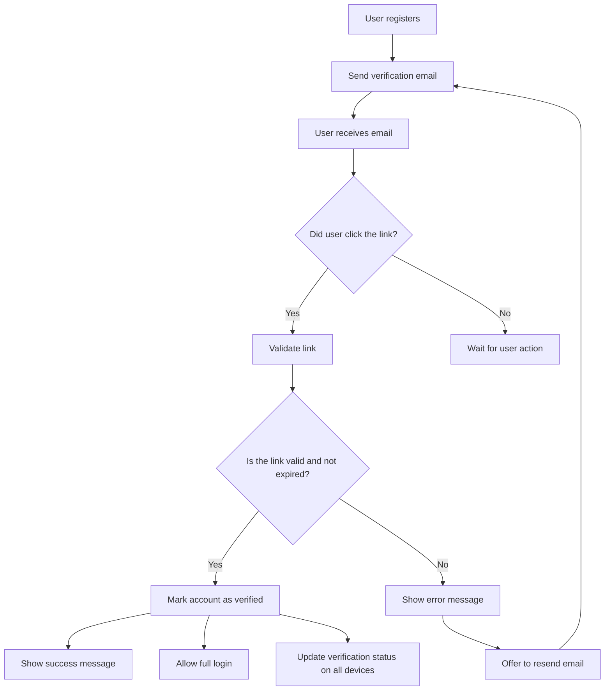

---

### Technical Flows (happy/sad path)

**Happy path:**
- User registers successfully
- System sends verification email
- User accesses the verification link
- System validates the link and marks the account as verified
- System shows success message and allows full access

**Sad path 1:**
- User accesses invalid/expired link
- System shows error message and offers to resend email

**Sad path 2:**
- User does not receive the email
- User requests resend
- System sends new email and invalidates previous links

---

### Traceability Checklist <-> Tests

| Account Verification Checklist Item           | Test Present  | Coverage  |
|:---------------------------------------------:|:-------------:|:---------:|
| Send verification email                       | No            |    ❌     |
| Process link and update status                | No            |    ❌     |
| Success message after verification            | No            |    ❌     |
| Login only with verified account              | No            |    ❌     |
| Update status on all devices                  | No            |    ❌     |
| Allow resend of email                         | No            |    ❌     |
| Invalidate previous links                     | No            |    ❌     |
| Error message for invalid link                | No            |    ❌     |
| Option to resend on error                     | No            |    ❌     |

---

## 8. Password Change

### Functional Narrative
As an authenticated user,
I want to be able to securely change my password,
so I can maintain my account security if I suspect it has been compromised or as part of good security practices.

---

### Scenarios (Acceptance Criteria)
_(Reference only for QA/business. Progress is only marked in the technical checklist)_
- Successful password change with correct current password and valid new password.
- Error if the current password provided is incorrect.
- Error if the new password does not meet security requirements.
- Notification (optionally by email) after successful password change.
- Invalidate other sessions (optional, but recommended for security) after password change.

---

### Technical Checklist for Password Change

- [❌] Validate the user's current password against the system.
- [❌] Validate that the new password meets defined strength criteria.
- [❌] Prevent the new password from being the same as the previous one (or the last N, if policy defined).
- [❌] Update the password securely in the authentication system.
- [❌] Invalidate the current session token and issue a new one if the change is successful.
- [❌] Optional: Implement invalidation of all other active user sessions.
- [❌] Notify the user of successful change (in app and/or by email).
- [❌] Log the password change event for audit.
- [❌] Handle connectivity errors during the process.
- [❌] Handle other server errors.

> Only items with real automated tests will be marked as completed. The rest must be implemented and tested before being marked as done.

---

### Data:
- Current password
- New password

---

### Technical Flows (happy/sad path)

**Happy path:**
- User initiates password change with correct current password and valid new password.
- System validates the current password.
- System updates the password securely.
- System invalidates the current session token and issues a new one.
- System notifies the user of successful change.
**Main Flow (happy path):
- Execute "Change Password" command with the provided data.
- System validates the format of the passwords.
- (Additionally) System verifies that the current password is correct.
- System sends the request to the server.
- System updates the stored credentials (the new password).
- System updates/invalidates the session token if necessary.
- System notifies successful change.

Error Flow – Incorrect Current Password (sad path):
- System logs the failed attempt.
- System notifies authentication error (incorrect current password).
- System checks if a temporary restriction should be applied (if there are multiple failures).

Error Flow – Invalid New Password (sad path):
- System notifies that password requirements are not met.
- System offers recommendations for a secure password.

Error Flow – No Connectivity (sad path):
- (Adjustment) System does not allow the change and notifies connectivity error. (Storing to retry a password change can be risky or complex to handle in terms of session state.)
- System offers the option to retry later.

---

### Technical Diagram of the Password Change Flow
*(This use case does not have a Mermaid diagram in the original document. One can be created if necessary)*

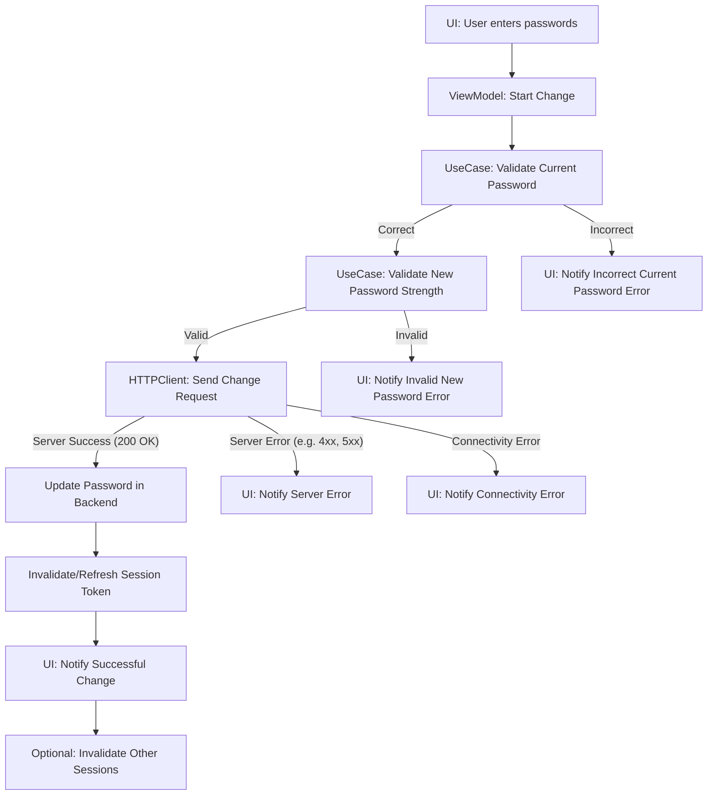

---

### Checklist Traceability <-> Tests

| Password Change Checklist Item                                 | Test Present  | Coverage  |
|:---------------------------------------------------------------|:-------------:|:---------:|
| Validate current password                                      | No            |    ❌     |
| Validate new password strength                                 | No            |    ❌     |
| Prevent reuse of previous password                             | No            |    ❌     |
| Securely update password                                       | No            |    ❌     |
| Invalidate/refresh session token                               | No            |    ❌     |
| Optional: Invalidate other sessions                            | No            |    ❌     |
| Notify successful change                                       | No            |    ❌     |
| Log password change event                                      | No            |    ❌     |
| Handle connectivity error                                      | No            |    ❌     |
| Handle other server errors                                     | No            |    ❌     |

---

## 9. Public Feed Viewing

### Story: Unauthenticated User Wants to View Public Content

**Narrative:**  
As a visitor or unauthenticated user  
I want to be able to view the public feed  
So that I can explore available content without needing to log in

---

### Scenarios (Acceptance Criteria)
_(Reference only for QA/business. Progress is tracked solely in the technical checklist)_
- Viewing public feed for unauthenticated users
- Hiding sensitive information in public mode
- Requesting authentication when accessing restricted content
- Handling connectivity errors
- Allowing manual feed reload
- Showing placeholders or empty states when no content is available

---

### Technical Checklist for Public Feed Viewing

- [❌] Show public feed for unauthenticated users
- [❌] Hide sensitive or private information in public mode
- [❌] Request authentication when accessing restricted content
- [❌] Handle connectivity errors and display clear messages
- [❌] Allow manual feed reload
- [❌] Show placeholders or empty states when no content is available

> Only items with real automated tests will be marked as completed. The rest must be implemented and tested before being marked as done.

---

### Technical Diagram of Public Feed Viewing Flow

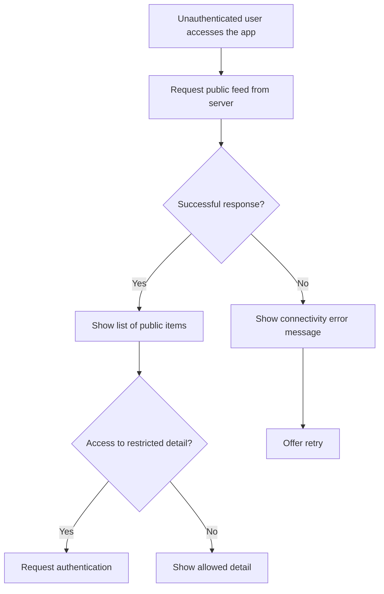

---

### Technical Flows (Happy/Sad Path)

**Happy path:**
- Unauthenticated user accesses the app
- System requests and receives the public feed
- System displays the list of public items
- User browses the feed and accesses allowed details

**Sad path 1:**
- User attempts to access restricted detail
- System requests authentication

**Sad path 2:**
- Connection fails when loading the feed
- System displays error message and allows retry

---

### Checklist Traceability <-> Tests

| Public Feed Checklist Item                     | Test Present  | Coverage  |
|:----------------------------------------------:|:-------------:|:---------:|
| Show public feed                              | No            |    ❌     |
| Hide sensitive information                    | No            |    ❌     |
| Request authentication for restricted access  | No            |    ❌     |
| Handle connectivity error                     | No            |    ❌     |
| Allow manual reload                           | No            |    ❌     |
| Show placeholders/empty states                | No            |    ❌     |

---

## 10. Authentication with External Providers

### Story: User Wants to Authenticate with External Providers

**Narrative:**  
As a user  
I want to be able to log in using external providers (Google, Apple, etc.)  
So that I can access the application quickly and securely without creating a new password

---

### Scenarios (Acceptance Criteria)
_(Reference only for QA/business. Progress is tracked solely in the technical checklist)_
- Successful authentication with external provider
- Automatic account creation if it is the first access
- Linking existing account if the email is already registered
- Handling external authentication errors
- Unlinking external provider
- Handling permission revocation from the provider
- Updating session and permissions after external authentication

---

### Technical Checklist for Authentication with External Providers

- [❌] Allow authentication with Google
- [❌] Allow authentication with Apple
- [❌] Automatically create account on first access
- [❌] Link existing account if email already exists
- [❌] Handle authentication errors and display clear messages
- [❌] Allow unlinking of external provider
- [❌] Handle permission revocation from provider
- [❌] Update session and permissions after external authentication

> Only items with real automated tests will be marked as completed. The rest must be implemented and tested before being marked as done.

---

### Technical Diagram of External Provider Authentication Flow

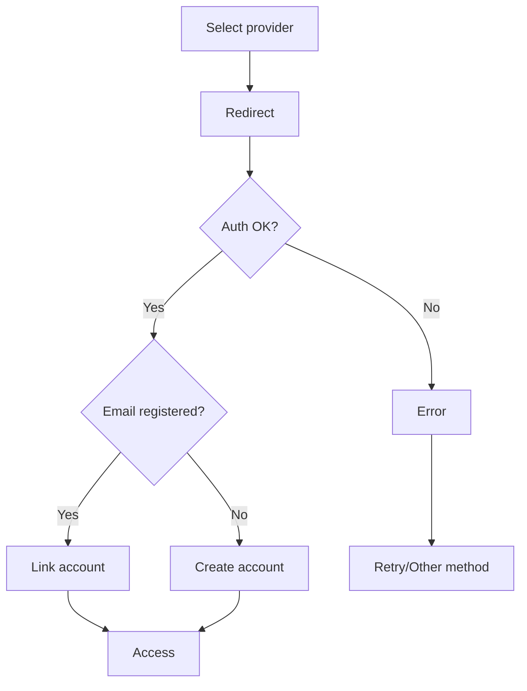

---

### Technical Flows (Happy/Sad Path)

**Happy path:**
- User selects external provider
- User is redirected and completes authentication
- System links or creates the account and updates the session
- User accesses the application with full permissions

**Sad path 1:**
- External authentication fails
- System displays error message and allows retry

**Sad path 2:**
- User revokes permissions from the provider
- System detects revocation, unlinks the account, and logs out

---

### Checklist Traceability <-> Tests

| External Authentication Checklist Item         | Test Present  | Coverage  |
|:----------------------------------------------:|:-------------:|:---------:|
| Allow authentication with Google              | No            |    ❌     |
| Allow authentication with Apple               | No            |    ❌     |
| Automatically create account                  | No            |    ❌     |
| Link existing account                         | No            |    ❌     |
| Handle authentication errors                  | No            |    ❌     |
| Allow unlinking of external provider          | No            |    ❌     |
| Handle permission revocation                  | No            |    ❌     |
| Update session and permissions                | No            |    ❌     |

---

## 11. Security Metrics

### Story: System Monitors Security Events

**Narrative:**  
As an authentication system  
I want to record and analyze security events  
So that I can detect threats and protect user accounts

---

### Scenarios (Acceptance Criteria)
_(Reference only for QA/business. Progress is tracked solely in the technical checklist)_
- Logging relevant security events
- Analyzing patterns of failed attempts
- Notifying administrators in critical events
- Secure and traceable storage of events
- Automatic actions in response to suspicious patterns
- Visualization and querying of security metrics

---

### Security Metrics Technical Checklist

- [❌] Log relevant security events
- [❌] Analyze patterns of failed attempts
- [❌] Notify administrators in critical events
- [❌] Store events securely and traceably
- [❌] Apply automatic actions for suspicious patterns
- [❌] Allow visualization and querying of metrics

> Only items with real automated tests will be marked as completed. The rest must be implemented and tested before being marked as done.

---

### Technical Diagram of Security Metrics Flow

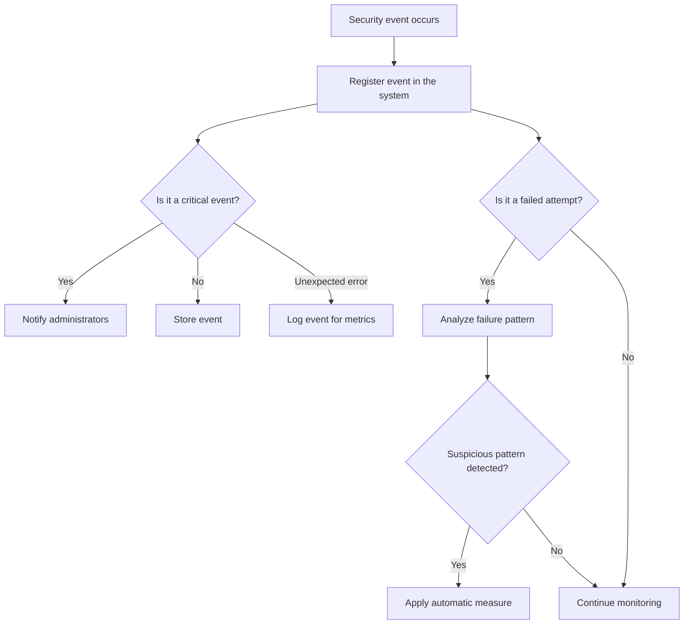

---

### Technical Flows (Happy/Sad Path)

**Happy path:**
- A security event occurs
- The system logs it correctly
- If it is critical, administrators are notified
- If it is a failed attempt, the system analyzes patterns and applies measures if suspicious
- Events are stored and can be consulted

**Sad path 1:**
- Event logging fails
- The system displays an error message and retries

**Sad path 2:**
- A suspicious pattern is not detected in time
- The system logs it as an incident for later analysis

---

### Checklist Traceability <-> Tests

| Security Metrics Checklist Item                | Test Present  | Coverage  |
|:----------------------------------------------:|:-------------:|:---------:|
| Log security events                            | No            |    ❌     |
| Analyze patterns of failed attempts            | No            |    ❌     |
| Notify administrators                         | No            |    ❌     |
| Securely store events                         | No            |    ❌     |
| Apply automatic measures                      | No            |    ❌     |
| Visualize and query metrics                   | No            |    ❌     |

---
## III. Advanced and Mobile-Specific Security Roadmap

This section describes additional use cases focused on strengthening application security at the client and mobile platform level. Their progressive implementation will contribute to greater robustness and protection of user data and application integrity.

---

## 12. Compromised Device Detection (Jailbreak/Root)

### Functional Narrative
As an application handling sensitive data,
I need to attempt to detect if I am running on a compromised device (jailbroken or rooted),
so I can take preventive measures and protect data integrity and application functionality.

### Scenarios (Acceptance Criteria)
- Positive detection of a compromised environment.
- Negative detection (device not compromised).
- The application reacts according to a defined policy when a compromised environment is detected (e.g., warn the user, limit functionality, deny service, notify the backend).

---

### Technical Checklist
- [❌] Implement jailbreak detection mechanisms (iOS).
- [❌] Implement root detection mechanisms (Android, if applicable).
- [❌] Define and document the application's reaction policy for compromised devices.
- [❌] Implement reaction logic according to the policy.
- [❌] Consider obfuscating detection mechanisms to make evasion harder.
- [❌] Tests to verify detection in simulated or real compromised environments.
- [❌] Tests to verify the correct application reaction.

---

*(Diagram, Technical Flows, and Traceability to be developed)*
---

## 13. Anti-Tampering and Code Obfuscation Protection

### Functional Narrative
As an application with sensitive business logic or security on the client side,
I need to apply measures to make reverse engineering, dynamic analysis, and unauthorized code modification (tampering) more difficult,
in order to protect intellectual property and the effectiveness of my security controls.

---

### Scenarios (Acceptance Criteria)
- Application of obfuscation techniques to critical parts of the code.
- Detection of attached debuggers (anti-debugging).
- Verification of application code integrity at runtime (checksums).
- The application reacts in a controlled manner if tampering or a debugger is detected.

---

### Technical Checklist
- [❌] Identify the most sensitive code sections that require obfuscation.
- [❌] Apply code obfuscation tools or techniques (class/method names, strings, control flow).
- [❌] Implement debugger detection techniques.
- [❌] Implement code or binary checksum verification mechanisms.
- [❌] Define and apply a reaction policy for tampering/debugging detection.
- [❌] Evaluate the impact of obfuscation on performance and debugging.

---

*(Diagram, Technical Flows, and Traceability to be developed)*
---

## 14. Screen Capture/Recording Protection (Sensitive Views)

### Functional Narrative
As an application that may display highly confidential information in specific views,
I need to be able to prevent or discourage screen capture or recording in those views,
to protect the privacy of sensitive data.

---

### Scenarios (Acceptance Criteria)
- Screen capture is blocked or the view is hidden/an overlay is shown when a capture is attempted on a marked sensitive view.
- Screen recording shows blacked out or hidden content for sensitive views.
- Normal capture/recording functionality in non-sensitive views.

---

### Technical Checklist
- [❌] Identify all views displaying sufficiently sensitive information to require this protection.
- [❌] Implement screenshot blocking in sensitive views (e.g., using `UIApplication.userDidTakeScreenshotNotification` and modifying the view, or specific APIs if available).
- [❌] Ensure sensitive view content is hidden during screen recording (e.g., `UIScreen.isCaptured` on iOS).
- [❌] Consider the user experience (e.g., notify why capture is not allowed).
- [❌] Tests to verify blocking/hiding in sensitive views.

---

*(Diagram, Technical Flows, and Traceability to be developed)*
---

## 15. Certificate Pinning

### Functional Narrative
As an application that communicates with a critical backend via HTTPS,
I need to ensure that I only trust the specific certificate (or public key) of my server,
to protect against man-in-the-middle (MitM) attacks using fake or compromised SSL/TLS certificates.

---

### Scenarios (Acceptance Criteria)
- Communication with the backend is successful when the server presents the expected certificate/public key.
- Communication with the backend fails if the server presents a different certificate/public key than expected.
- Strategy for updating pins in the application in case the server certificate changes.

---

### Technical Checklist
- [❌] Decide on the pinning strategy (full certificate pin, public key pin, intermediate/root CA pin - less recommended for self-signed or controlled CAs).
- [❌] Extract the production server's certificate(s) or public key(ies).
- [❌] Implement pin validation logic in the application's network layer (e.g., `URLSessionDelegate`).
- [❌] Securely store the pins within the application.
- [❌] Define and test the pin update strategy (e.g., via app update, or a secure delivery mechanism if dynamic).
- [❌] Comprehensive tests for successful (correct pin) and failed (incorrect pin, different certificate) connections.

---

*(Diagrama, Cursos Técnicos y Trazabilidad a desarrollar)*
---
## 16. Secure Handling of Sensitive Data in Memory

### Functional Narrative
As an application that temporarily handles highly sensitive data (e.g., passwords, API keys, session tokens) in memory,
I need to minimize the exposure time of this data and ensure it is cleared from memory as soon as it is no longer needed,
to reduce the risk of extraction by malware or memory analysis tools.

---

### Scenarios (Acceptance Criteria)
- Passwords entered by the user are cleared from memory after being used for authentication or password change.
- API keys or session tokens are handled carefully and cleared when the session ends or they are no longer valid, if possible.
- Use of secure data types if the platform/language provides them (e.g., `SecureString` in other contexts, or equivalent techniques in Swift).

---

### Technical Checklist
- [❌] Identify all variables and data structures containing critical information in memory.
- [❌] Implement overwriting or setting these variables to nil as soon as their content is no longer needed.
- [❌] Research and use, if possible, data types or techniques that make persistence or extraction from memory more difficult (e.g., careful handling of `String` for passwords).
- [❌] Be aware of compiler optimizations that could keep copies of data in memory.
- [❌] For highly critical data, consider using non-swappable memory regions (if the platform allows and it is justifiable).
- [❌] Perform memory analysis (if possible with tools) to verify data cleanup.

---

*(Diagram, Technical Flows, and Traceability to be developed)*
---

## 17. Secure Biometric Authentication (Touch ID/Face ID)

### Functional Narrative
As a user, I want to be able to use my device's biometric authentication (Touch ID/Face ID) to access the application or authorize sensitive operations quickly and securely,
and as an application, I need to integrate this functionality correctly, handling possible failures and respecting the security of the underlying credentials.

---

### Scenarios (Acceptance Criteria)
- Successful configuration of biometric authentication for the app (if it requires opt-in).- Successful biometric authentication allows access/authorization.
- Biometric authentication failures (e.g., not recognized, too many attempts) are handled properly, offering a fallback (e.g., app PIN/password).
- Changes in the device's biometric configuration (e.g., new fingers/faces added, biometrics disabled) invalidate or require revalidation of the app's biometric configuration.
- Keys or tokens protected by biometrics are securely stored (e.g., in Keychain with the `kSecAccessControlBiometryCurrentSet` flag or similar).

---

### Technical Checklist
- [❌] Integrate the `LocalAuthentication` framework.
- [❌] Request permission to use biometrics contextually.
- [❌] Handle all possible `LAError` error codes.
- [❌] Implement a secure fallback mechanism if biometrics fail or are unavailable.
- [❌] To protect data with biometrics, use Keychain attributes that require biometric authentication for access (`kSecAccessControl...`).
- [❌] Consider handling `evaluatedPolicyDomainState` to detect changes in the system's biometric configuration and revalidate if necessary.
- [❌] Provide clear feedback to the user during the authentication process.
- [❌] Tests for successful, failed, and fallback flows.

---

*(Diagram, Technical Flows, and Traceability to be developed)*
---

## 18. Detailed Secure Logout (Server Invalidation)

### Functional Narrative
As a user, when I log out of the application,
I want my session to be completely invalidated, not only locally but also on the server if possible,
to ensure that previous session tokens can no longer be used.

---

### Scenarios (Acceptance Criteria)
- Upon logout, all local session data (tokens, user cache) is deleted.
- If the backend supports token invalidation, a call is made to the server's logout endpoint to invalidate the current token.
- The user is redirected to the login screen or to an unauthenticated state.
- Failures in the server invalidation call are handled (e.g., local cleanup still occurs, retry or inform the user).

---

### Technical Checklist
- [❌] Implement complete cleanup of all locally stored session data (Keychain, UserDefaults, in-memory variables).
- [❌] If the backend has a logout endpoint to invalidate tokens (e.g., JWT in a blacklist), implement the call to this endpoint.
- [❌] Handle the server's response (success/error) to the invalidation call.
- [❌] Ensure the UI correctly reflects the unauthenticated state.
- [❌] Tests to verify local cleanup and server call.

---

*(Diagram, Technical Flows, and Traceability to be developed)*
---
## 19. Secure Device Permissions Management

### Functional Narrative
As an application that requires certain device permissions (e.g., location, contacts, camera, notifications) to offer its full functionality,
I need to request and manage these permissions transparently, securely, and respectfully of the user's privacy,
ensuring that they are only requested when necessary and that the user understands why.

---

### Scenarios (Acceptance Criteria)
- Permissions are requested only when a feature that requires them is about to be used for the first time (contextual request).
- A clear explanation is provided to the user about why the permission is needed before the system's formal request.
- The app correctly handles cases where the user grants or denies the permission.
- The app behaves predictably and offers alternatives (if possible) when a required permission is denied.
- The app respects the revocation of permissions by the user from system settings.
- The permission state is checked before attempting to use features that require them (do not assume a previously granted permission is still active).

---

### Technical Checklist
- [❌] Identify all device permissions the app needs and for which features.
- [❌] Implement permission requests using the platform's correct APIs (e.g., `CoreLocation`, `Contacts`, `UserNotifications`).
- [❌] Design and implement a "pre-request" UI to explain the need for the permission before the system alert.
- [❌] Handle all permission authorization states (granted, denied, restricted, not determined).
- [❌] Provide guidance to the user on how to change permissions in system settings if initially denied and then wanted.
- [❌] Check the current permission state every time a dependent feature is about to be used.
- [❌] Ensure the app does not crash or behave unexpectedly if a permission is denied or revoked.
- [❌] Tests for all request flows and permission states.

---


  

## Image Feed Feature Specs

### Story: Customer requests to see their image feed

### Narrative #1

```
As an online customer
I want the app to automatically load my latest image feed
So I can always enjoy the newest images of my friends
```

#### Scenarios (Acceptance criteria)

```
Given the customer has connectivity
 When the customer requests to see their feed
 Then the app should display the latest feed from remote
  And replace the cache with the new feed
```

### Narrative #2

```
As an offline customer
I want the app to show the latest saved version of my image feed
So I can always enjoy images of my friends
```

#### Scenarios (Acceptance criteria)

```
Given the customer doesn't have connectivity
  And there’s a cached version of the feed
 ## 🧪 Test Pattern for HTTPClient with URLProtocolStub

To ensure that `HTTPClient` integration tests are deterministic, fast, and do not depend on the real network, we use a network stub (`URLProtocolStub`) and a custom `URLSession` configuration.

**Why not use `.shared`?**
- Using `.shared` can cause interference between tests and accidental dependencies on the real network.
- Each test must be hermetic: full control over responses, with no side effects or external dependencies.

**Recommended pattern:**
```swift
private func makeSUT(
    session: URLSession? = nil,
    file: StaticString = #file,
    line: UInt = #line
) -> HTTPClient {
    let configuration = URLSessionConfiguration.ephemeral
    configuration.protocolClasses = [URLProtocolStub.self]
    let session = session ?? URLSession(configuration: configuration)
    let sut = URLSessionHTTPClient(session: session)
    trackForMemoryLeaks(sut, file: file, line: line)
    return sut as HTTPClient
}
```
- This way, all integration tests use the stub, avoiding the real network.
- If a test needs a special session, it can provide one.

**Advantages:**
- Fast, predictable, and flake-free tests.
- Full isolation of each test case.
- Facilitates TDD/BDD and confidence in the test suite.

> **Note:** This pattern is especially useful in modular projects, CI, and when there are concurrent tests.  
 And the cache is less than seven days old
 When the customer requests to see the feed
 Then the app should display the latest feed saved

Given the customer doesn't have connectivity
  And there’s a cached version of the feed
  And the cache is seven days old or more
 When the customer requests to see the feed
 Then the app should display an error message

Given the customer doesn't have connectivity
  And the cache is empty
 When the customer requests to see the feed
 Then the app should display an error message
```

## Use Cases

### Load Feed From Remote Use Case

#### Data:
- URL

#### Primary course (happy path):
1. Execute "Load Image Feed" command with above data.
2. System downloads data from the URL.
3. System validates downloaded data.
4. System creates image feed from valid data.
5. System delivers image feed.

#### Invalid data – error course (sad path):
1. System delivers invalid data error.

#### No connectivity – error course (sad path):
1. System delivers connectivity error.

---

### Load Feed Image Data From Remote Use Case

#### Data:
- URL

#### Primary course (happy path):
1. Execute "Load Image Data" command with above data.
2. System downloads data from the URL.
3. System validates downloaded data.
4. System delivers image data.

#### Cancel course:
1. System does not deliver image data nor error.

#### Invalid data – error course (sad path):
1. System delivers invalid data error.

#### No connectivity – error course (sad path):
1. System delivers connectivity error.

---

### Load Feed From Cache Use Case

#### Primary course:
1. Execute "Load Image Feed" command with above data.
2. System retrieves feed data from cache.
3. System validates cache is less than seven days old.
4. System creates image feed from cached data.
5. System delivers image feed.

#### Retrieval error course (sad path):
1. System delivers error.

#### Expired cache course (sad path): 
1. System delivers no feed images.

#### Empty cache course (sad path): 
1. System delivers no feed images.

---

### Load Feed Image Data From Cache Use Case

#### Data:
- URL

#### Primary course (happy path):
1. Execute "Load Image Data" command with above data.
2. System retrieves data from the cache.
3. System delivers cached image data.

#### Cancel course:
1. System does not deliver image data nor error.

#### Retrieval error course (sad path):
1. System delivers error.

#### Empty cache course (sad path):
1. System delivers not found error.

---

### Validate Feed Cache Use Case

#### Primary course:
1. Execute "Validate Cache" command with above data.
2. System retrieves feed data from cache.
3. System validates cache is less than seven days old.

#### Retrieval error course (sad path):
1. System deletes cache.

#### Expired cache course (sad path): 
1. System deletes cache.

---

### Cache Feed Use Case

#### Data:
- Image Feed

#### Primary course (happy path):
1. Execute "Save Image Feed" command with above data.
2. System deletes old cache data.
3. System encodes image feed.
4. System timestamps the new cache.
5. System saves new cache data.
6. System delivers success message.

#### Deleting error course (sad path):
1. System delivers error.

#### Saving error course (sad path):
1. System delivers error.

---

### Cache Feed Image Data Use Case

#### Data:
- Image Data

#### Primary course (happy path):
1. Execute "Save Image Data" command with above data.
2. System caches image data.
3. System delivers success message.

#### Saving error course (sad path):
1. System delivers error.

---

## Flowchart


## Model Specs

### Feed Image

| Property      | Type                |
|---------------|---------------------|
| `id`          | `UUID`              |
| `description` | `String` (optional) |
| `location`    | `String` (optional) |
| `url`	        | `URL`               |

### Payload contract

```
GET /feed

200 RESPONSE

{
	"items": [
		{
			"id": "a UUID",
			"description": "a description",
			"location": "a location",
			"image": "https://a-image.url",
		},
		{
			"id": "another UUID",
			"description": "another description",
			"image": "https://another-image.url"
		},
		{
			"id": "even another UUID",
			"location": "even another location",
			"image": "https://even-another-image.url"
		},
		{
			"id": "yet another UUID",
			"image": "https://yet-another-image.url"
		}
		...
	]
}
```

---

## Image Comments Feature Specs

### Story: Customer requests to see image comments

### Narrative

```
As an online customer
I want the app to load image commments
So I can see how people are engaging with images in my feed
```

#### Scenarios (Acceptance criteria)

```
Given the customer has connectivity
 When the customer requests to see comments on an image
 Then the app should display all comments for that image
```

```
Given the customer doesn't have connectivity
 When the customer requests to see comments on an image
 Then the app should display an error message
```

## Use Cases

### Load Image Comments From Remote Use Case

#### Data:
- ImageID

#### Primary course (happy path):
1. Execute "Load Image Comments" command with above data.
2. System loads data from remote service.
3. System validates data.
4. System creates comments from valid data.
5. System delivers comments.

#### Invalid data – error course (sad path):
1. System delivers invalid data error.

#### No connectivity – error course (sad path):
1. System delivers connectivity error.

---

## Model Specs

### Image Comment

| Property          | Type                    |
|-------------------|-------------------------|
| `id`              | `UUID`                  |
| `message` 	    | `String`			      |
| `created_at`      | `Date` (ISO8601 String) |
| `author` 			| `CommentAuthorObject`   |

### Image Comment Author

| Property          | Type                |
|-------------------|---------------------|
| `username` 	    | `String`			  |

### Payload contract

```
GET /image/{image-id}/comments

2xx RESPONSE

{
	"items": [
		{
			"id": "a UUID",
			"message": "a message",
			"created_at": "2020-05-20T11:24:59+0000",
			"author": {
				"username": "a username"
			}
		},
		{
			"id": "another UUID",
			"message": "another message",
			"created_at": "2020-05-19T14:23:53+0000",
			"author": {
				"username": "another username"
			}
		},
		...
	]
}
```

---

## App Architecture


<!-- COVERAGE-REPORT-START -->
# 📊 Code Coverage Summary

**Total coverage:** **91.39%**

---

## Files with Highest Coverage

| File | Coverage | Covered by Test |
|---|---|---|
| [UserLoginUseCase.swift](/Users/juancarlosmerlosalbarracin/Developer/Essential_Developer/essential-feed-case-study/EssentialFeed/Authentication Feature/UserLoginUseCase.swift) | 100.00% | UserLoginUseCaseTests.swift |
| [SecureStorage.swift](/Users/juancarlosmerlosalbarracin/Developer/Essential_Developer/essential-feed-case-study/EssentialFeed/Security Feature/SecureStorage.swift) | 100.00% | KeychainSecureStorageTests.swift
SystemKeychainIntegrationCoverageTests.swift
SecureStorageTests.swift |
| [UserRegistrationUseCase.swift](/Users/juancarlosmerlosalbarracin/Developer/Essential_Developer/essential-feed-case-study/EssentialFeed/EssentialFeed/Registration Feature/UserRegistrationUseCase.swift) | 97.46% | UserRegistrationUseCaseTests+Server.swift
UserRegistrationUseCaseTests.swift |
| [SystemKeychain.swift](/Users/juancarlosmerlosalbarracin/Developer/Essential_Developer/essential-feed-case-study/EssentialFeed/EssentialFeed/Security Feature/Keychain/SystemKeychain.swift) | 51.85% | SystemKeychainIntegrationCoverageTests.swift
SystemKeychainTests.swift
SecureStorageTests.swift |

## Files with Lower Coverage (>0%)

| File | Coverage | Covered by Test |
|---|---|---|
| [SystemKeychain.swift](/Users/juancarlosmerlosalbarracin/Developer/Essential_Developer/essential-feed-case-study/EssentialFeed/EssentialFeed/Security Feature/Keychain/SystemKeychain.swift) | 51.85% | SystemKeychainIntegrationCoverageTests.swift
SystemKeychainTests.swift
SecureStorageTests.swift |
| [UserRegistrationUseCase.swift](/Users/juancarlosmerlosalbarracin/Developer/Essential_Developer/essential-feed-case-study/EssentialFeed/EssentialFeed/Registration Feature/UserRegistrationUseCase.swift) | 97.46% | UserRegistrationUseCaseTests+Server.swift
UserRegistrationUseCaseTests.swift |
| [UserLoginUseCase.swift](/Users/juancarlosmerlosalbarracin/Developer/Essential_Developer/essential-feed-case-study/EssentialFeed/Authentication Feature/UserLoginUseCase.swift) | 100.00% | UserLoginUseCaseTests.swift |
| [SecureStorage.swift](/Users/juancarlosmerlosalbarracin/Developer/Essential_Developer/essential-feed-case-study/EssentialFeed/Security Feature/SecureStorage.swift) | 100.00% | KeychainSecureStorageTests.swift
SystemKeychainIntegrationCoverageTests.swift
SecureStorageTests.swift |

---
## Production files **without any associated test**

All production files have at least one associated test.

> These files have no direct test associated according to the mapping by name and use case. Review if they require coverage or if they are candidates for refactoring.

### How to read this report?
- **Total coverage:** Percentage of lines covered by tests in the entire target.
- **Highest coverage:** Files best covered by tests.
- **Lowest coverage:** Files with the lowest coverage (but greater than 0%).

> For coverage by class or function, check the `coverage-report.txt` file.
<!-- COVERAGE-REPORT-END -->
