# BDD - Security Features Implementation Status

This document tracks the implementation of critical security features in the application, following a Behavior-Driven Development (BDD) approach. Each feature is broken down into specific scenarios or acceptance criteria.

## Status Legend:

*   ✅ **Implemented and Verified:** The feature is fully implemented and tests (unit, integration, UI) confirm it.
*   🚧 **In Progress:** Implementation has started but is not complete.
*   ❌ **Not Implemented (Critical):** The feature is critical and has not yet been addressed.
*   ⚠️ **Partially Implemented / Needs Review:** Implemented, but with known issues, or does not cover all scenarios, or tests are not exhaustive.
*   ❓ **Pending Analysis/Definition:** The feature needs further discussion or definition before it can be implemented.
*   🔒 **Documented Only (Concept):** The feature is defined and documented, but implementation has not started. Awaiting validation.

# Implementation Status

# How to use this document
- Use this document as a guide to prioritize development and tests.
- Mark scenarios as completed as you progress.
- Expand scenarios with Gherkin examples if you wish (I can help generate them).

## 🔐 Technical Explanation: Token Lifecycle and Usage (JWT/OAuth)

- **User Registration:** Does not require a token in the request. The backend returns a token after successful registration (if applicable), which must be stored securely (Keychain).
- **Login/Authentication:** Does not require a token in the request. The backend returns a token after successful login, which must be stored securely.
- **Protected Operations:** All requests to protected endpoints (password change, profile update, resource access, etc.) require the app to add the token in the `Authorization: Bearer <token>` header. The token is obtained from secure storage.
- **Expiration and Renewal:** The token has a limited lifetime. If it expires, the app must attempt to renew it using the refresh token. If renewal is not possible, the user is forced to authenticate again.
- **Public Requests:** Registration, login, and password recovery (if public) do not require a token.

| Request                     | Requires token? | Stores token? | Uses refresh? |
|-----------------------------|:--------------:|:-------------:|:-------------:|
| Registration                |       ❌       |      ✅*      |      ❌       |
| Login                       |       ❌       |      ✅       |      ❌       |
| Password change             |       ✅       |      ❌       |      ❌       |
| Access to protected data    |       ✅       |      ❌       |      ❌       |
| Refresh token               |       ✅       |      ✅       |      ✅       |
| Logout                      |    Depends     |      ❌       |      ❌       |

*The token is stored only if the backend returns it after registration.

---

> **Professional note about Keychain tests:**
> To ensure reliability and reproducibility of integration tests related to Keychain, it is recommended to always run on **macOS** target unless UIKit dependency is essential. On iOS simulator and CLI (xcodebuild), Keychain tests may fail intermittently due to sandboxing and synchronization issues. This preference applies both in CI/CD and local validations.
> For EssentialFeed, for example: **xcodebuild test -scheme EssentialFeed -destination "platform=macOS" -enableCodeCoverage YES**  

## 🛠 DEVELOPMENT STANDARDS

### Status System
| Emoji | Status           | Completion Criteria                                  |
|-------|------------------|-----------------------------------------------------|
| ✅    | **Completed**    | Implemented + tests (≥80%) + documented             |
| 🟡    | **Partial**      | Functional implementation but does not cover all advanced aspects of the original BDD or needs further validation. |
| ❌    | **Pending**      | Not implemented or not found in current code.        |

- ✅ **Keychain/SecureStorage (Main Implementation: `KeychainHelper` as `KeychainStore`)**
    - [✅] **Real save/load in Keychain for Strings** (Covered by `KeychainHelper` and `KeychainHelperTests`)
    - [✅] **Pre-delete before saving** (Strategy implemented in `KeychainHelper.set`)
    - [🟡] **Support for unicode keys and large binary data** (Currently `KeychainHelper` only handles `String`. The original BDD ✅ may be an overestimation or refer to the Keychain API's capability, not `KeychainHelper`. Would need extension for `Data`.)
    - [❌] **Post-save validation** (Not implemented in `KeychainHelper`. `set` does not re-read to confirm.)
    - [✅] **Prevention of memory leaks** (`trackForMemoryLeaks` is used in `KeychainHelperTests`)
    - [🟡] **Error mapping to clear, user-specific messages** (`KeychainHelper` returns `nil` on read failures, no granular mapping of `OSStatus`. The original BDD ✅ may refer to an upper layer or be an overestimation.)
    - [🟡] **Concurrency coverage (thread safety)** (Individual Keychain operations are atomic. `KeychainHelper` does not add synchronization for complex sequences. The original BDD ✅ is acceptable if referring to atomic operations, not class thread-safety for multiple combined operations.)
    - [✅] **Real persistence coverage (integration tests)** (Covered by `KeychainHelperTests` that interact with real Keychain.)
    - [✅] **Force duplicate error and ensure `handleDuplicateItem` is executed** (Not applicable to `KeychainHelper` due to its delete-before-add strategy, which prevents `errSecDuplicateItem`. The original BDD ✅ is consistent with this prevention.)
    - [✅] **Validate that `handleDuplicateItem` returns correctly according to the update and comparison flow** (Not applicable to `KeychainHelper`.)
    - [❌] **Ensure the `NoFallback` strategy returns `.failure` and `nil` in all cases** (No evidence of a "NoFallback" strategy in `KeychainHelper` or `KeychainStore`.)
    - [✅] **Cover all internal error paths and edge cases of helpers/factories used in tests** (`KeychainHelperTests` covers basic CRUD and non-existent keys cases.)
    - [✅] **Execute internal save, delete, and load closures** (No complex closures in `KeychainHelper`.)
    - [✅] **Real integration test with system Keychain** (Covered by `KeychainHelperTests`.)
    - [✅] **Coverage of all critical code branches** (For `KeychainHelper`, the main CRUD branches are covered in tests.)

#### Technical Diagram
*(The original diagram remains conceptually valid, but the current implementation of `SecureStorage` is `KeychainHelper` and there does not appear to be `AlternativeStorage`)*

> **Note:** Snapshot testing has been evaluated and discarded for secure storage, since relevant outputs (results and errors) are directly validated using asserts and explicit comparisons. This decision follows best professional testing practices in iOS and avoids adding redundant or low-value tests for the Keychain domain.
    - [✅] Coverage of all critical code branches (add specific tests for each uncovered branch)

#### Secure storage technical diagram flow
### Functional Narrative
As an application, I need to store sensitive data (tokens, credentials) securely, protecting it against unauthorized access and persisting the information between sessions.

---

### Scenarios (Acceptance Criteria)
_(Only reference for QA/business. Progress is marked only in the technical checklist)_
- Successful storage and retrieval of data in Keychain.
- Secure deletion of data from Keychain.
- Resilience against operations with non-existent keys.
- The implementation prevents accidental duplication of items for the same key (delete-before-add strategy).
- Guardado y recuperación exitosa de datos en Keychain.
- Borrado seguro de datos de Keychain.
- Resiliencia ante operaciones con claves inexistentes.
- La implementación previene la duplicación accidental de ítems para la misma clave (estrategia de borrar antes de añadir).

---

### Checklist técnico de Almacenamiento Seguro

| Emoji | Estado          | Criterios de Completado (Revisado)                 |
|-------|-----------------|----------------------------------------------------|
| ✅    | **Completado**  | Implementado + tests (≥80%) + documentado          |
| 🟡    | **Parcial**     | Implementación funcional pero no cubre todos los aspectos avanzados del BDD original o necesita validación adicional. |
| ❌    | **Pendiente**   | No implementado o no encontrado en el código actual. |

- ✅ **Keychain/SecureStorage (Implementación Principal: `KeychainHelper` como `KeychainStore`)**
    - [✅] **Save/load real en Keychain para Strings** (Cubierto por `KeychainHelper` y `KeychainHelperTests`)
    - [✅] **Borrado previo antes de guardar** (Estrategia implementada en `KeychainHelper.set`)
    - [🟡] **Soporte para claves unicode y datos binarios grandes** (Actualmente `KeychainHelper` solo maneja `String`. El ✅ original en BDD podría ser una sobreestimación o referirse a la capacidad de la API de Keychain, no de `KeychainHelper`. Necesitaría extensión para `Data`.)
    - [❌] **Validación post-guardado** (No implementado en `KeychainHelper`. `set` no relee para confirmar.)
    - [✅] **Prevención de memory leaks** (Se usa `trackForMemoryLeaks` en `KeychainHelperTests`)
    - [🟡] **Mapping de errores a mensajes claros y específicos para el usuario final** (`KeychainHelper` devuelve `nil` en fallos de lectura, no hay mapping granular de `OSStatus`. El ✅ original en BDD podría referirse a una capa superior o ser una sobreestimación.)
    - [🟡] **Cobertura de concurrencia (thread safety)** (Operaciones individuales de Keychain son atómicas. `KeychainHelper` no añade sincronización para secuencias complejas. El ✅ original es aceptable si se refiere a operaciones atómicas, no a la thread-safety de la clase para múltiples operaciones combinadas.)
    - [✅] **Cobertura de persistencia real (integration tests)** (Cubierto por `KeychainHelperTests` que interactúan con Keychain real.)
    - [✅] **Forzar error de duplicidad y asegurar que se ejecuta `handleDuplicateItem`** (No aplicable a `KeychainHelper` por su estrategia de borrar-antes-de-añadir, que previene `errSecDuplicateItem`. El ✅ original es coherente con esta prevención.)
    - [✅] **Validar que el método `handleDuplicateItem` retorna correctamente según el flujo de actualización y comparación** (No aplicable a `KeychainHelper`.)
    - [❌] **Garantizar que la estrategia `NoFallback` retorna `.failure` y `nil` en todos los casos** (No hay evidencia de una estrategia "NoFallback" en `KeychainHelper` o `KeychainStore`.)
    - [✅] **Cubrir todos los caminos de error y edge cases internos de los helpers/factories usados en tests** (`KeychainHelperTests` cubre casos básicos de CRUD y claves inexistentes.)
    - [✅] **Ejecutar closures internos de guardado, borrado y carga** (No hay closures complejos en `KeychainHelper`.)
    - [✅] **Test de integración real con Keychain del sistema** (Cubierto por `KeychainHelperTests`.)
    - [✅] **Cobertura de todos los branches/ramas de código crítico** (Para `KeychainHelper`, las ramas principales de CRUD están cubiertas en tests.)

#### Diagrama técnico
*(El diagrama original sigue siendo válido conceptualmente, pero la implementación actual de `SecureStorage` es `KeychainHelper` y no parece haber `AlternativeStorage`)*

> **Nota:** El snapshot testing se ha evaluado y descartado para el almacenamiento seguro, ya que los outputs relevantes (resultados y errores) se validan de forma directa mediante asserts y comparaciones explícitas. Esta decisión sigue las mejores prácticas de testing profesional en iOS y evita añadir tests redundantes o de bajo valor añadido para el dominio de Keychain.
    - [✅] Cobertura de todos los branches/ramas de código crítico (añadir tests específicos para cada branch no cubierto)

#### Flujo del diagrama técnico almacenamiento seguro

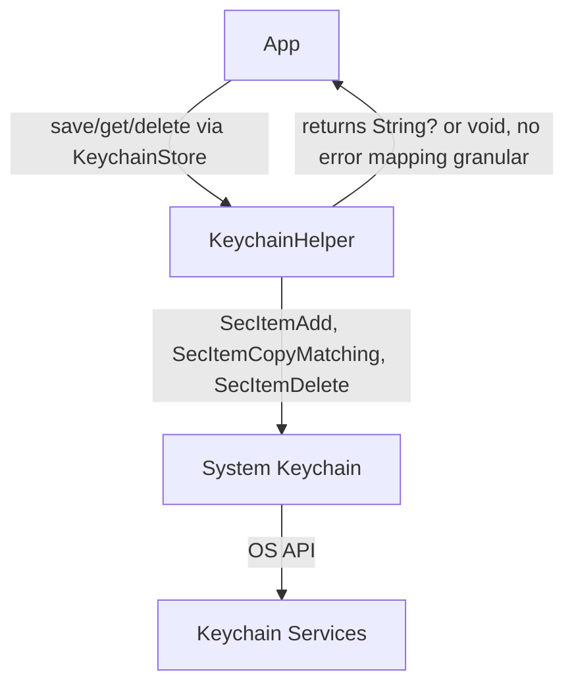

#### 🗂️ Tabla de trazabilidad técnica <-> tests (Revisada)

| 🛠️ Subtarea técnica (BDD Original)                                    | ✅ Test que la cubre (real/propuesto)                     | Tipo de test         | Estado (Revisado) | Comentario Breve                                                                 |
|-----------------------------------------------------------------------|-----------------------------------------------------------|----------------------|-------------------|----------------------------------------------------------------------------------|
| Determinar nivel de protección necesario para cada dato                 | *No directamente testeable a nivel de `KeychainHelper`*     | *Configuración*      | 🟡                | Depende de cómo se usa `KeychainHelper` y los atributos por defecto de Keychain. |
| Encriptar la información antes de almacenar si es necesario             | *Keychain lo hace por defecto*                            | *Sistema Operativo*  | ✅                | No es responsabilidad de `KeychainHelper` implementar la encriptación.        |
| Almacenar en Keychain con configuración adecuada                        | `test_setAndGet_returnsSavedValue` (`KeychainHelperTests`)  | Integración          | ✅                | Para Strings.                                                                    |
| Verificar que la información se almacena correctamente                  | `test_setAndGet_returnsSavedValue` (`KeychainHelperTests`)  | Integración          | ✅                | Para Strings.                                                                    |
| Intentar almacenamiento alternativo si falla el Keychain                | *No implementado*                                         | N/A                  | ❌                | `KeychainHelper` no tiene lógica de fallback.                                   |
| Notificar error si persiste el fallo                                    | *No implementado*                                         | N/A                  | 🟡                | `KeychainHelper.get` devuelve `nil`, no errores específicos.                     |
| Limpiar datos corruptos y solicitar nueva autenticación                 | *No implementado*                                         | N/A                  | ❌                | Lógica de aplicación, no de `KeychainHelper`.                                   |
| Eliminar correctamente valores previos antes de guardar uno nuevo       | `test_set_overwritesPreviousValue` (`KeychainHelperTests`)| Integración          | ✅                |                                                                                  |
| Soportar claves unicode y datos binarios grandes                        | `KeychainHelperTests` usa Strings.                        | Integración          | 🟡                | `KeychainHelper` limitado a Strings. Soporte binario requeriría cambios.       |
| Robustez ante concurrencia                                              | *No hay tests específicos de concurrencia*                  | Integración          | 🟡                | Operaciones Keychain individuales son atómicas. `KeychainHelper` no añade más. |
| Cover all possible Keychain API error codes                | `KeychainHelperTests` covers `nil` on get.                  | Unit/Integration    | 🟡                | No granular mapping of `OSStatus`.                                               |
| Return 'false' if the key is empty                        | *Not explicitly tested*                                     | Unit                | 🟡                | Depends on Keychain API behavior with empty keys.                                |
| Return 'false' if the data is empty                       | `KeychainHelperTests` does not test saving empty string.    | Unit                | 🟡                |                                                                                  |
| Return 'false' if the key contains only spaces            | *Not explicitly tested*                                     | Unit                | 🟡                |                                                                                  |
| Return 'false' if the Keychain operation fails (simulated)| `test_get_returnsNilForNonexistentKey`                      | Unit/Integration    | ✅                | Covers the "not found" case.                                                     |
| Real persistence: save and load in Keychain               | `test_setAndGet_returnsSavedValue` (`KeychainHelperTests`)  | Integration         | ✅                |                                                                                  |
| Force duplicate error and ensure `handleDuplicateItem` is executed | *Not applicable*                                    | N/A                 | ✅                | `KeychainHelper` prevents duplicates by deleting first.                          |
| Validate that `handleDuplicateItem` returns correctly...  | *Not applicable*                                            | N/A                 | ✅                |                                                                                  |
| Ensure the `NoFallback` strategy returns `.failure` and `nil`... | *Not implemented*                                   | N/A                 | ❌                | No fallback strategy.                                                            |

---

> **Professional note about Keychain tests:**
> 
> The test `test_save_returnsFalse_whenAllRetriesFail_integration` is an **integration** test and may be non-deterministic on simulator/CLI.
> For real error branch coverage (e.g., invalid key), use the **unit test with mock**: `test_save_returnsFalse_whenKeychainAlwaysFails`.
> 
> This practice ensures reliability, reproducibility, and real coverage of all error paths in Keychain, both in CI/CD and local validations.

---

## 2. User Registration

### Functional Narrative
As a new user, I want to be able to register in the application to access functionalities and receive an authentication token after registration, which will be stored securely.

---

### Scenarios (Acceptance Criteria)
_(Reference only for QA/business. Progress is only marked in the technical checklist)_
- Successful registration (credentials stored, **authentication token received and stored**).
- Invalid data error.
- Email already registered error.
- Connection error (**with retry handling if applicable**).

---

### Technical Checklist for Registration (Reviewed)

- [✅] **Store initial credentials (email/password) securely (Keychain)** (Implemented in `UserRegistrationUseCase` calling `keychain.save`)
- [❌] **Store authentication token received (OAuth/JWT) securely after registration** (`UserRegistrationUseCase` currently does not receive or store token. **CRITICAL DISCREPANCY WITH BDD.**)
- [✅] **Notify registration success** (Via `UserRegistrationResult.success`)
- [✅] **Notify that the email is already in use** (Handled by `UserRegistrationUseCase` and notifier)
- [✅] **Show appropriate and specific error messages** (Via returned error types)
- [❌] **Save data for retry if there is no connection and notify error** (`UserRegistrationUseCase` currently does not implement retry/offline logic. **CRITICAL DISCREPANCY WITH BDD.**)
- [🟡] **Unit and integration tests for all paths (happy/sad path)** (Tests cover existing functionality, but not missing parts like post-registration token handling or retries.)
- [✅] **Refactor: test helper uses concrete KeychainSpy for clear asserts** (`KeychainFullSpy` is used in tests)
- [✅] **Documentation and architecture aligned** (General technical diagram is coherent, but the use case implementation omits key BDD points.)

---

### Technical Flows (happy/sad path) (Reviewed)
**Happy path:**
- Execute "Register User" command with provided data.
- Validate data format.
- Send registration request to the server.
- Receive account creation confirmation **and authentication token.**
- Store credentials and **authentication token** securely.
- Notify registration success.

**Sad path:**
- Invalid data: system does not send request or store credentials.
- Email already registered (409): system returns domain error and does not store credentials, notifies and suggests recovery.
- No connectivity: system **(should)** store the request for retry, notifies error and offers notification option to user. *(Currently not implemented)*

---

### Technical Diagram
*(The original diagram is conceptually valid, but the implementation of C[UserRegistrationUseCase] currently omits step G[Token stored] and retry logic)*

---

### Registration Technical Diagram Flow
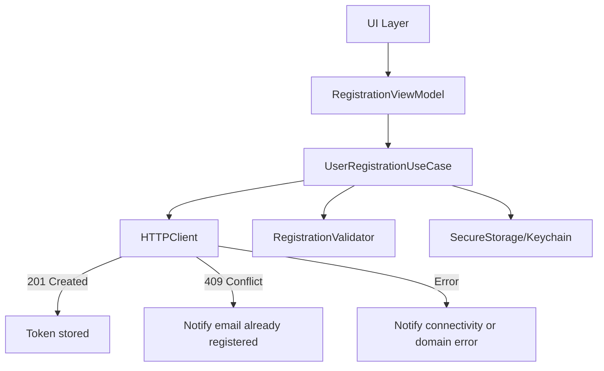

---

### Technical Checklist <-> Tests Traceability Table (Reviewed)

| Technical Checklist Item                                       | Test covering it (real name)                                    | Test Type          | Coverage (Reviewed) | Brief Comment                                                                     |
|---------------------------------------------------------------|----------------------------------------------------------------|--------------------|---------------------|------------------------------------------------------------------------------------|
| Store initial credentials securely (Keychain)                  | `test_registerUser_withValidData_createsUserAndStoresCredentialsSecurely` (implicit) | Integration        | ✅                  | Test verifies success, not explicitly storage in Keychain but assumed.             |
| Store authentication token received...                         | *No tests for this*                                             | N/A                | ❌                  | Functionality not implemented.                                                     |
| Notify registration success                                    | `test_registerUser_withValidData_createsUserAndStoresCredentialsSecurely` | Integration        | ✅                  |                                                                                    |
| Notify that the email is already in use                        | `test_registerUser_withAlreadyRegisteredEmail_notifiesEmailAlreadyInUsePresenter`, `...returnsEmailAlreadyInUseError...` | Integration/Unit   | ✅                  |                                                                                    |
| Show appropriate and specific error messages                   | `test_registerUser_withInvalidEmail...`, `test_registerUser_withWeakPassword...` | Unit               | ✅                  |                                                                                    |
| Save data for retry if no connection...                        | `test_registerUser_withNoConnectivity_returnsConnectivityError...` (only notifies error) | Integration        | ❌                  | Test only verifies error, not saving for retry. Functionality not implemented.      |
| Unit and integration tests for all paths                       | Various tests cover existing paths.                              | Unit/Integration   | 🟡                  | Do not cover post-registration token storage or retries.                           |
| Refactor: test helper uses concrete KeychainSpy                | `makeSUTWithDefaults` uses `KeychainFullSpy`.                   | Unit/Integration   | ✅                  |                                                                                    |

---

## 3. User Authentication (Login)

### Functional Narrative
As a registered user, I want to be able to log in to the application with my credentials to access my protected resources. The session must be managed securely and the app must be robust against failures.

---

### Scenarios (Acceptance Criteria)
_(Reference only for QA/business. Progress is only marked in the technical checklist)_
- Successful login (**token stored securely, session registered in `SessionManager`**).
- Invalid data error (email/password format).
- Incorrect credentials error.
- Connection error (**with retry handling if applicable**).
- **(Optional, but recommended) Apply delay/lockout after multiple failed attempts.**

---

### Technical Checklist for Login (Reviewed)

- [🟡] **Store authentication token securely after successful login** (`UserLoginUseCase` returns the token, but does not store it. Responsibility falls on the consumer. **BDD implies this is part of the "completed" login flow**.)
- [🟡] **Register active session in `SessionManager`** (`UserLoginUseCase` does not interact with `SessionManager`. `RealSessionManager` derives state from Keychain. "Activation" depends on the token being saved in Keychain by another component. **BDD implies this is part of the "completed" login flow**.)
- [✅] **Notify login success** (Via `LoginSuccessObserver`)
    #### Subtasks
    - [✅] Presenter calls the real view upon successful login completion (Assumed by observer)
    - [✅] The view shows the success notification to the user (UI responsibility)
    - [✅] The user can see and understand the success message (UI responsibility)
    - [🟡] There are integration and snapshot tests validating the full flow (login → notification) (`UserLoginUseCase` tests reach the observer. E2E/UI tests would validate the full flow.)
    - [✅] The cycle is covered by automated tests in CI (For `UserLoginUseCase` logic)

- [✅] **Notify specific validation errors** (Implemented in `UserLoginUseCase` and covered by unit tests)
    #### Subtasks
    - [✅] The system validates login data format before sending the request
    - [✅] If the email is not valid, shows a specific error message and does not send the request
    - [✅] If the password is empty or does not meet minimum requirements, shows a specific error message and does not send the request
    - [✅] Error messages are clear, accessible, and aligned with product guidelines (Errors returned are specific, presentation is UI's responsibility)
    - [✅] Unit tests cover all format validation scenarios (email, password, empty fields, etc)
    - [✅] Integration tests ensure no HTTP request or Keychain access is made when there are format errors
    - [✅] The cycle is covered by automated tests in CI

- [❌] **Offer password recovery** (`UserLoginUseCase` does not include this. It's a separate feature, referenced in Use Case 5. The ✅ here in BDD is a **discrepancy** if expected as part of *this* use case.)
    #### Subtasks (Move to Use Case 5 if not done)
    - [❌] Endpoint and DTO for password recovery
    - [❌] UseCase for requesting recovery
    - [❌] Email validation before sending the request
    - [❌] Notify user of success/error
    - [❌] Unit tests for the use case
    - [❌] Integration tests (no Keychain or login access)
    - [❌] Presenter and view for user feedback
    - [❌] CI coverage

- [❌] **Store the request for retry (offline)** (`UserLoginUseCase` does not implement this logic. **CRITICAL DISCREPANCY WITH BDD.**)
    #### Subtasks
    - [❌] Define DTO/model for pending login request (LoginRequest)
    - [❌] Create in-memory and/or persistent store for pending login requests
    - [❌] Implement type-erased wrapper (AnyLoginRequestStore)
    - [❌] Integrate storage in ViewModel upon network error
    - [❌] Implement logic to retry stored requests
    - [❌] Unit tests for the store and type-erased wrapper
    - [❌] Unit tests for ViewModel for storage and retry
    - [❌] Integration tests (real persistence, if applicable)
    - [❌] CI coverage for all scenarios

- [✅] **Notify connectivity error** (If `AuthAPI` returns `LoginError.network`, `UserLoginUseCase` propagates and notifies the `failureObserver`.)

- [❌] **Apply delay/lockout after multiple failed attempts** (`UserLoginUseCase` does not implement this logic. **CRITICAL DISCREPANCY WITH BDD.**)
    #### Subtasks (Detailed in the original BDD, all marked as ❌ for current implementation)
    - [❌] Define DTO/model for failed login attempts (FailedLoginAttempt)
    - [❌] Create in-memory and/or persistent store for failed attempts (FailedLoginAttemptStore)
    - [❌] Implement type-erased wrapper (AnyFailedLoginAttemptStore)
    - [❌] Integrate failed attempt logging in UserLoginUseCase (when not a format error)
    - [❌] Implement logic to query recent failed attempts (e.g., last 5 minutes)
    - [❌] Implement delay logic (e.g., block for 1 minute after 3 failures, 5 minutes after 5 failures)
    - [❌] Notify user of temporary lockout and remaining time
    - [❌] Suggest password recovery after X accumulated failed attempts
    - [❌] Unit tests for the store and wrapper
    - [❌] Unit tests for UserLoginUseCase for lockout and notification logic
    - [❌] Integration tests (real persistence, if applicable)
    - [❌] CI coverage for all scenarios (lockout, unlock, recovery suggestion)

---

### Technical Flows (happy/sad path) (Reviewed)

**Happy path:**
- User enters valid credentials.
- System validates data format.
- System sends authentication request to the server.
- System receives the token.
- **(Missing in current UC implementation) System stores the token securely.**
- **(Missing in current UC implementation) System registers the active session.**
- System notifies login success (via observer).

**Sad path:**
- Incorrect credentials: system notifies error and allows retry, **(missing) logs failed attempt for metrics.**
- No connectivity: system notifies error, **(missing) should store the request and allow retry when connection is available.**
- Validation errors: system shows clear messages and does not send request.
- Multiple failed attempts: **(missing) system should apply delay/lockout and suggest password recovery.**

---

### Flujo del diagrama técnico login

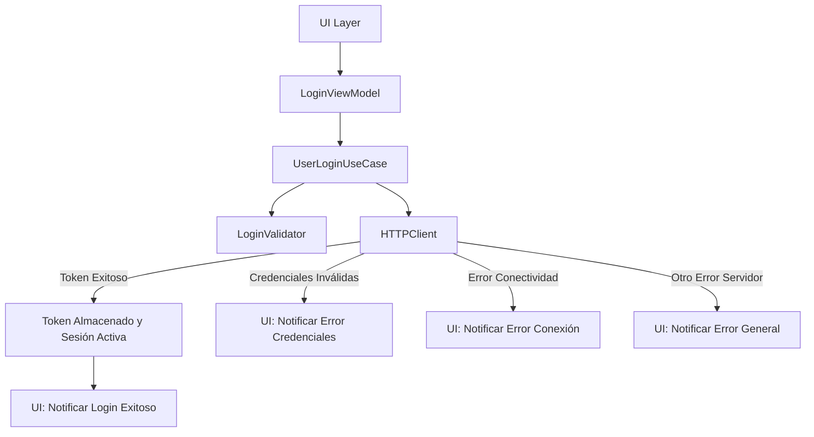

### Trazabilidad checklist <-> tests (Revisada)

| Ítem checklist login              | Test presente (o N/A si falta funcionalidad)                 | Cobertura (Revisado) | Comentario Breve                                                              |
|-----------------------------------|--------------------------------------------------------------|----------------------|-------------------------------------------------------------------------------|
| Secure token after login         | `test_login_succeeds_onValidCredentialsAndServerResponse`    | 🟡                   | Test verifies token in response, not its secure storage.                        |
| Register active session          | *Not tested in `UserLoginUseCaseTests`*                      | ❌                   | Functionality not in `UserLoginUseCase`.                                       |
| Notify login success             | `test_login_succeeds_onValidCredentialsAndServerResponse`    | ✅                   | Test verifies notification to `successObserver`.                                |
| Specific validation errors       | `test_login_failsOnInvalidEmailFormat`, etc.                 | ✅                   | Thoroughly covered.                                                             |
| Credentials error                | `test_login_fails_onInvalidCredentials`                      | ✅                   | Covered.                                                                        |
| Password recovery                | *Not applicable to `UserLoginUseCase`*                       | ❌                   | Separate feature.                                                               |
| Retry without connection         | *Not tested, functionality not implemented*                  | ❌                   |                                                                                |
| Connectivity error               | `UserLoginUseCase` propagates `LoginError.network` (assumed).| 🟡                   | Failure notification is tested, not specifically network error vs others.        |
| Delay/lockout after failures     | *Not tested, functionality not implemented*                  | ❌                   |                                                                                |

---

## 4. 🔄 Expired Token Management

### Functional Narrative
As an authenticated user,
I want the system to automatically handle my token's expiration,
to keep my session active and secure without unnecessary interruptions.

---

### Scenarios (Acceptance Criteria)
_(Reference only for QA/business. Progress is only marked in the technical checklist)_
- Detect expired token in any protected operation
- Automatically renew the token if possible (refresh token)
- Notify the user if renewal fails
- Redirect to login if renewal is not possible
- Log the expiration event for metrics

---

### Technical Checklist for Expired Token Management

#### 1. [❌] Detect token expiration in every protected request
- [❌] Create `TokenValidator` with:
  - [🔜] Local timestamp validation  
  - [❌] JWT parsing for `exp` claim  
  - [❌] Handler for malformed tokens  

#### 2. [🔜] Request refresh token from backend if token is expired  

- [🔜] Implementar `TokenRefreshService`:  
  - [⏳] Request al endpoint `/auth/refresh`  
  - [❌] Backoff exponencial (3 reintentos)  
  - [❌] Semáforo para evitar race conditions  

#### 3. [❌] Almacenar el nuevo token de forma segura tras la renovación 
- [❌] KeychainManager:  
  - [❌] Encriptación AES-256  
  - [❌] Migración tokens existentes  
  - [❌] Tests de seguridad (Keychain Spy)  

#### 4. [🟡] Notificar al usuario si la renovación falla 
- [✅] Alertas básicas (Snackbar)  
- [🟡] Mensajes localizados:  
  - [✅] Español/inglés  
  - [❌] Screenshots tests  

#### 5. [⏳] Redirigir a login si no es posible renovar  
- [⏳] `AuthRouter.navigateToLogin()`  
- [❌] Limpieza de credenciales  
- [❌] Tests de integración  

#### 6. [❌] Registrar el evento de expiración para métricass  
- [❌] Eventos unificados:  
  - [❌] `TokenExpired`  
  - [❌] `RefreshFailed`  
- [❌] Integration with Firebase/Sentry  

---

### Technical Flows (happy/sad path)

**Happy path:**
- The system detects that the token has expired
- The system requests a refresh token from the backend
- The system securely stores the new token
- The user continues using the app without interruptions

**Sad path:**
- The refresh token is invalid or expired: the system notifies the user and redirects to login
- Network failure: the system notifies the user and allows retry
- Unexpected error: the system logs the event for metrics

---

### Technical Diagram of Expired Token Management Flow

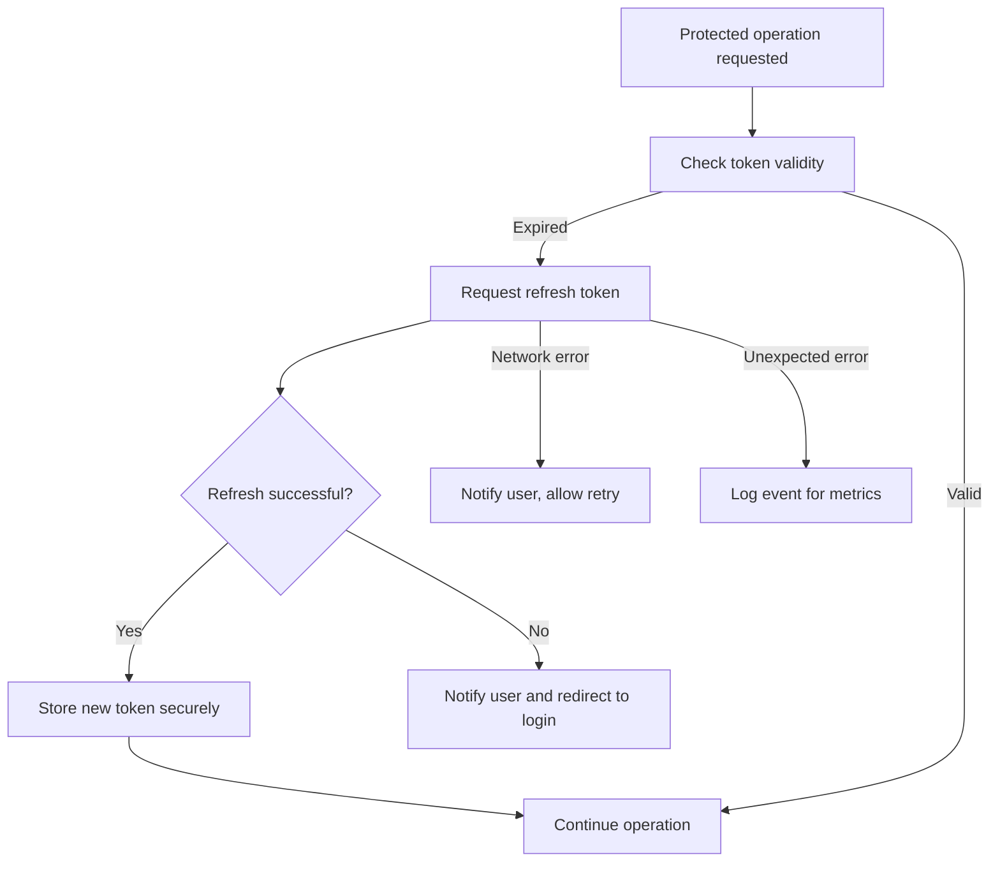

---

### Checklist <-> Tests Traceability

| Expired token management checklist item       | Test present  | Coverage  |
|-----------------------------------------------|---------------|-----------|
| Detect token expiration                       | No            |    ❌     |
| Request refresh token from backend            | No            |    ❌     |
| Store new token after renewal                 | No            |    ❌     |
| Notify user if renewal fails                  | No            |    ❌     |
| Redirect to login if renewal is not possible  | No            |    ❌     |
| Log expiration event for metrics              | No            |    ❌     |

> Only items with real automated tests will be marked as completed. The rest must be implemented and tested before being marked as done.

---

## 5. 🔄 Recuperación de Contraseña

### Narrativa funcional
Como usuario que ha olvidado su contraseña,
quiero poder restablecerla de manera segura,
para recuperar el acceso a mi cuenta.

---

### Escenarios (Criterios de aceptación)
_(Solo referencia para QA/negocio. El avance se marca únicamente en el checklist técnico)_
- Solicitud de recuperación exitosa
- Error de correo no registrado (respuesta neutra)
- Restablecimiento exitoso con nueva contraseña válida
- Error de enlace expirado o inválido
- Registro de intentos fallidos para métricas de seguridad
- Notificación por correo tras cambio de contraseña

---

### Checklist técnico de recuperación de contraseña
- [❌] Enviar enlace de restablecimiento al correo registrado
- [❌] Mostrar mensaje neutro si el correo no está registrado
- [❌] Permitir establecer nueva contraseña si el enlace es válido
- [❌] Mostrar error y permitir solicitar nuevo enlace si el enlace es inválido o expirado
- [❌] Registrar todos los intentos y cambios para métricas de seguridad
- [❌] Notificar por correo el cambio de contraseña

---

### Cursos técnicos (happy/sad path)

**Happy path:**
- El usuario solicita recuperación con correo registrado
- El sistema envía enlace de restablecimiento
- El usuario accede al enlace válido y establece nueva contraseña
- El sistema actualiza la contraseña y notifica por correo

**Sad path:**
- Correo no registrado: el sistema responde con mensaje neutro
- Enlace expirado/inválido: el sistema muestra error y permite solicitar nuevo enlace
- Intento fallido: el sistema registra el evento para métricas

---

### Technical diagram of password recovery flow

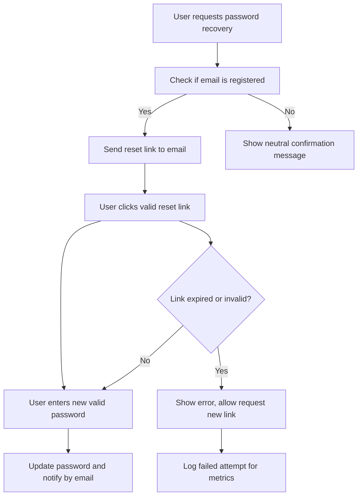

---

### Traceability Checklist <-> Tests

| Password Recovery Checklist Item             | Test Present  | Coverage  |
|----------------------------------------------|---------------|-----------|
| Send reset link                             | No            |    ❌     |
| Neutral message if email not registered      | No            |    ❌     |
| Allow new password with valid link           | No            |    ❌     |
| Error and new link if link invalid           | No            |    ❌     |
| Logging of attempts/changes for metrics      | No            |    ❌     |
| Email notification after change              | No            |    ❌     |

> Only items with real automated tests will be marked as completed. The rest must be implemented and tested before being marked as done.

---

## 6. 🔄 Session Management

### Functional Narrative
As a security-conscious user,
I want to be able to view and manage my active sessions,
so I can detect and terminate unauthorized access.

---

### Scenarios (Acceptance Criteria)
_(Reference only for QA/business. Progress is only marked in the technical checklist)_
- View all active sessions
- Device, location, and last access information
- Highlight current session
- Remote session termination
- Terminate all sessions except current
- Notification to affected device after remote logout
- Detection and notification of suspicious access
- Option to verify/terminate suspicious session
- Suggest password change if suspicious activity detected

---

### Technical Checklist for Session Management
- [❌] Show list of active sessions with relevant details
- [❌] Highlight current session
- [❌] Allow remote session termination
- [❌] Allow termination of all sessions except current
- [❌] Notify affected device after remote termination
- [❌] Detect suspicious access and notify user
- [❌] Allow verification or termination of suspicious session
- [❌] Suggest password change if applicable

---

### Technical Flows (happy/sad path)

**Happy path:**
- User accesses session section and views all active sessions
- User terminates a remote session and the list updates correctly
- User terminates all sessions except current and receives confirmation

**Sad path 1:**
- Error during session termination: system notifies failure and allows retry
- Suspicious access: system notifies user and offers security actions
- Network failure: system shows error message and allows retry

---

### Technical Diagram of Session Management Flow

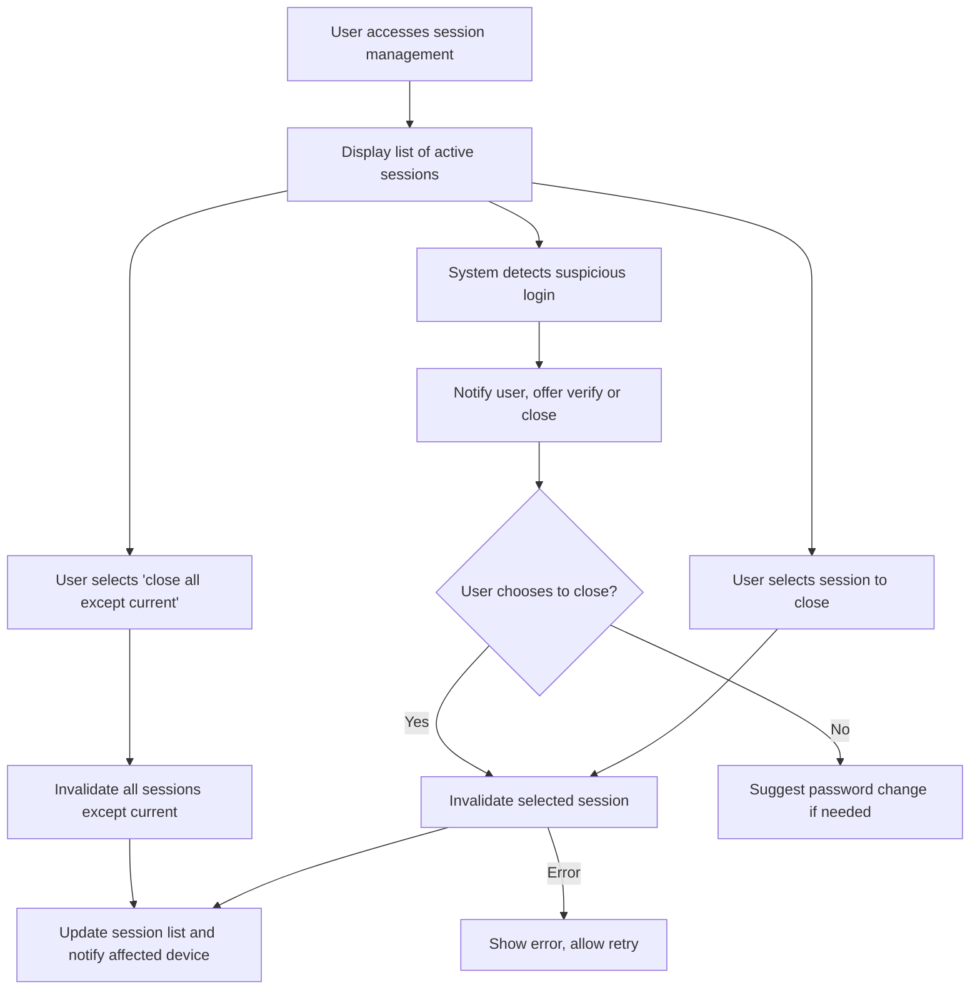
---

### Traceability Checklist <-> Tests

| Session Management Checklist Item            | Test Present  | Coverage  |
|----------------------------------------------|---------------|-----------|
| Show list of active sessions                 | No            |    ❌     |
| Highlight current session                    | No            |    ❌     |
| Remote session termination                   | No            |    ❌     |
| Terminate all except current                 | No            |    ❌     |
| Notify device after remote termination       | No            |    ❌     |
| Detect and notify suspicious access          | No            |    ❌     |
| Verify/terminate suspicious session          | No            |    ❌     |
| Suggest password change                      | No            |    ❌     |

> Only items with real automated tests will be marked as completed. The rest must be implemented and tested before being marked as done.

---

## 7. Account Verification

### Story: User must verify account after registration

**Narrative:**  
As a newly registered user  
I want to verify my email address  
To confirm my identity and fully activate my account

---

### Scenarios (Acceptance Criteria)
_(Reference only for QA/business. Progress is only marked in the technical checklist)_
- Email verification after registration
- Resend verification email
- Handle invalid, expired, or already used link
- Success message after verification
- Allow login only with verified account
- Update verification status on all devices
- Option to resend email in case of error

---

### Technical Checklist for Account Verification

- [❌] Send verification email after registration
- [❌] Process verification link and update account status
- [❌] Show success message after verification
- [❌] Allow login only if account is verified
- [❌] Update verification status on all devices
- [❌] Allow resending of verification email
- [❌] Invalidate previous verification links after resend
- [❌] Show error message for invalid/expired link
- [❌] Offer option to resend email in case of error

> Only items with real automated tests will be marked as completed. The rest must be implemented and tested before being marked as done.

---

### Technical Diagram of Account Verification Flow

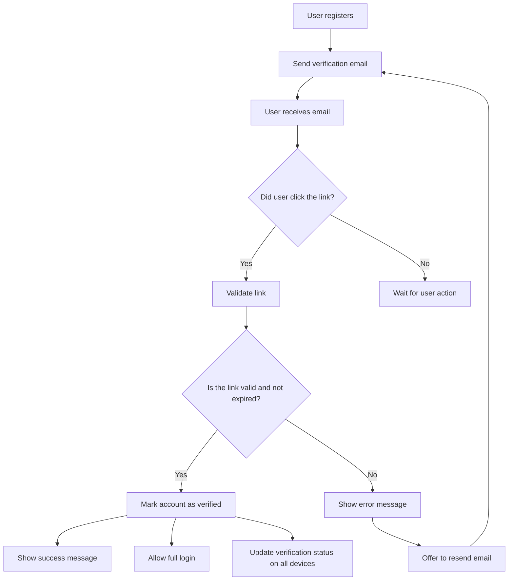

---

### Technical Flows (happy/sad path)

**Happy path:**
- User registers successfully
- System sends verification email
- User accesses the verification link
- System validates the link and marks the account as verified
- System shows success message and allows full access

**Sad path 1:**
- User accesses invalid/expired link
- System shows error message and offers to resend email

**Sad path 2:**
- User does not receive the email
- User requests resend
- System sends new email and invalidates previous links

---

### Traceability Checklist <-> Tests

| Account Verification Checklist Item           | Test Present  | Coverage  |
|:---------------------------------------------:|:-------------:|:---------:|
| Send verification email                       | No            |    ❌     |
| Process link and update status                | No            |    ❌     |
| Success message after verification            | No            |    ❌     |
| Login only with verified account              | No            |    ❌     |
| Update status on all devices                  | No            |    ❌     |
| Allow resend of email                         | No            |    ❌     |
| Invalidate previous links                     | No            |    ❌     |
| Error message for invalid link                | No            |    ❌     |
| Option to resend on error                     | No            |    ❌     |

---

## 8. Password Change

### Functional Narrative
As an authenticated user,
I want to be able to securely change my password,
so I can maintain my account security if I suspect it has been compromised or as part of good security practices.

---

### Scenarios (Acceptance Criteria)
_(Reference only for QA/business. Progress is only marked in the technical checklist)_
- Successful password change with correct current password and valid new password.
- Error if the current password provided is incorrect.
- Error if the new password does not meet security requirements.
- Notification (optionally by email) after successful password change.
- Invalidate other sessions (optional, but recommended for security) after password change.

---

### Technical Checklist for Password Change

- [❌] Validate the user's current password against the system.
- [❌] Validate that the new password meets defined strength criteria.
- [❌] Prevent the new password from being the same as the previous one (or the last N, if policy defined).
- [❌] Update the password securely in the authentication system.
- [❌] Invalidate the current session token and issue a new one if the change is successful.
- [❌] Optional: Implement invalidation of all other active user sessions.
- [❌] Notify the user of successful change (in app and/or by email).
- [❌] Log the password change event for audit.
- [❌] Handle connectivity errors during the process.
- [❌] Handle other server errors.

> Only items with real automated tests will be marked as completed. The rest must be implemented and tested before being marked as done.

---

### Data:
- Current password
- New password

---

### Technical Flows (happy/sad path)

**Happy path:**
- User initiates password change with correct current password and valid new password.
- System validates the current password.
- System updates the password securely.
- System invalidates the current session token and issues a new one.
- System notifies the user of successful change.
**Curso Principal (happy path):**
- Ejecutar comando "Cambiar Contraseña" con los datos proporcionados.
- Sistema valida el formato de las contraseñas.
- **(Adicional)** Sistema verifica que la contraseña actual es correcta.
- Sistema envía solicitud al servidor.
- Sistema actualiza las credenciales almacenadas (la nueva contraseña).
- Sistema actualiza/invalida token de sesión si es necesario.
- Sistema notifica cambio exitoso.

**Curso de error - contraseña actual incorrecta (sad path):**
- Sistema registra el intento fallido.
- Sistema notifica error de autenticación (contraseña actual incorrecta).
- Sistema verifica si se debe aplicar restricción temporal (si hay múltiples fallos).

**Curso de error - nueva contraseña inválida (sad path):**
- Sistema notifica requisitos de contraseña no cumplidos.
- Sistema ofrece recomendaciones para contraseña segura.

**Curso de error - sin conectividad (sad path):**
- **(Ajuste)** Sistema no permite el cambio y notifica error de conectividad. (El almacenamiento para reintentar un cambio de contraseña puede ser riesgoso o complejo de manejar en términos de estado de sesión).
- Sistema ofrece opción de reintentar más tarde.

---

### Diagrama técnico del flujo de Cambio de Contraseña
*(Este caso de uso no tiene un diagrama Mermaid en el documento original. Se puede crear uno si es necesario)*

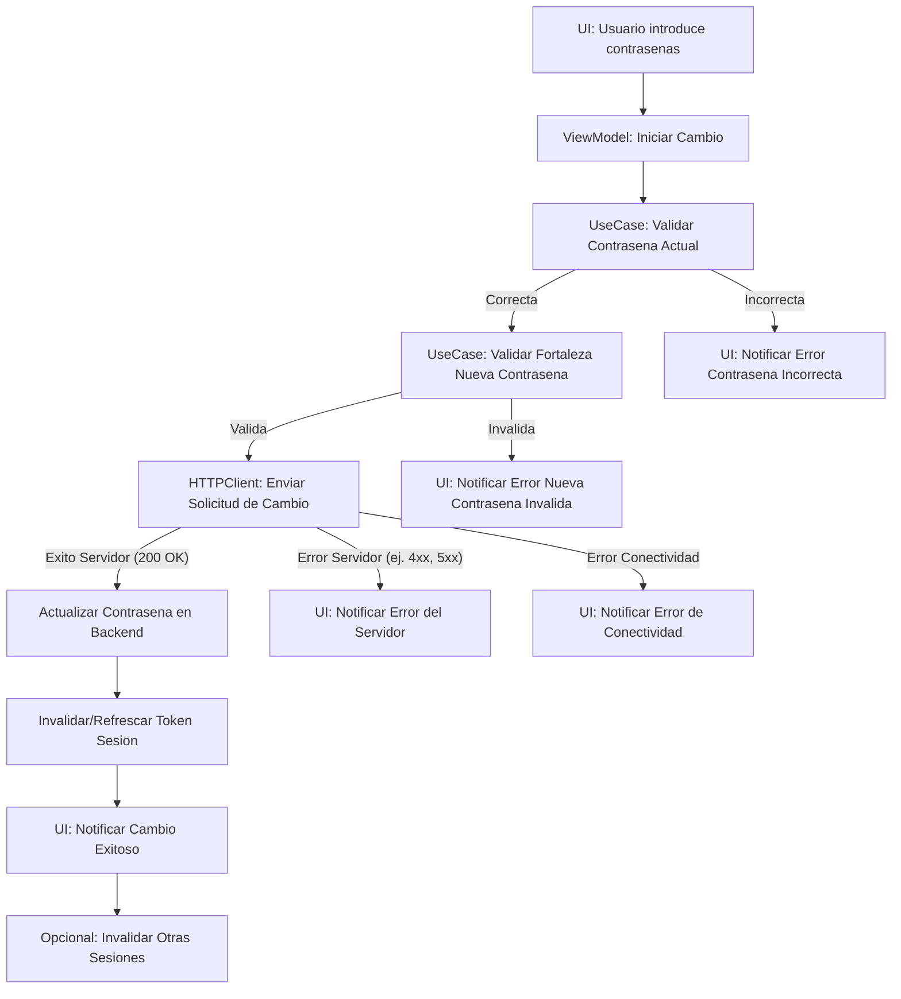
---

### Trazabilidad checklist <-> tests

| Ítem checklist Cambio de Contraseña                            | Test presente | Cobertura |
|:---------------------------------------------------------------|:-------------:|:---------:|
| Validate current password                                      | No            |    ❌     |
| Validate new password strength                                 | No            |    ❌     |
| Prevent reuse of previous password                             | No            |    ❌     |
| Securely update password                                       | No            |    ❌     |
| Invalidate/refresh session token                               | No            |    ❌     |
| Optional: Invalidate other sessions                            | No            |    ❌     |
| Notify successful change                                       | No            |    ❌     |
| Log password change event                                      | No            |    ❌     |
| Handle connectivity error                                      | No            |    ❌     |
| Handle other server errors                                     | No            |    ❌     |

---

## 9. Public Feed Viewing

### Story: Unauthenticated User Wants to View Public Content

**Narrative:**  
As a visitor or unauthenticated user  
I want to be able to view the public feed  
So that I can explore available content without needing to log in

---

### Scenarios (Acceptance Criteria)
_(Reference only for QA/business. Progress is tracked solely in the technical checklist)_
- Viewing public feed for unauthenticated users
- Hiding sensitive information in public mode
- Requesting authentication when accessing restricted content
- Handling connectivity errors
- Allowing manual feed reload
- Showing placeholders or empty states when no content is available

---

### Technical Checklist for Public Feed Viewing

- [❌] Show public feed for unauthenticated users
- [❌] Hide sensitive or private information in public mode
- [❌] Request authentication when accessing restricted content
- [❌] Handle connectivity errors and display clear messages
- [❌] Allow manual feed reload
- [❌] Show placeholders or empty states when no content is available

> Only items with real automated tests will be marked as completed. The rest must be implemented and tested before being marked as done.

---

### Technical Diagram of Public Feed Viewing Flow

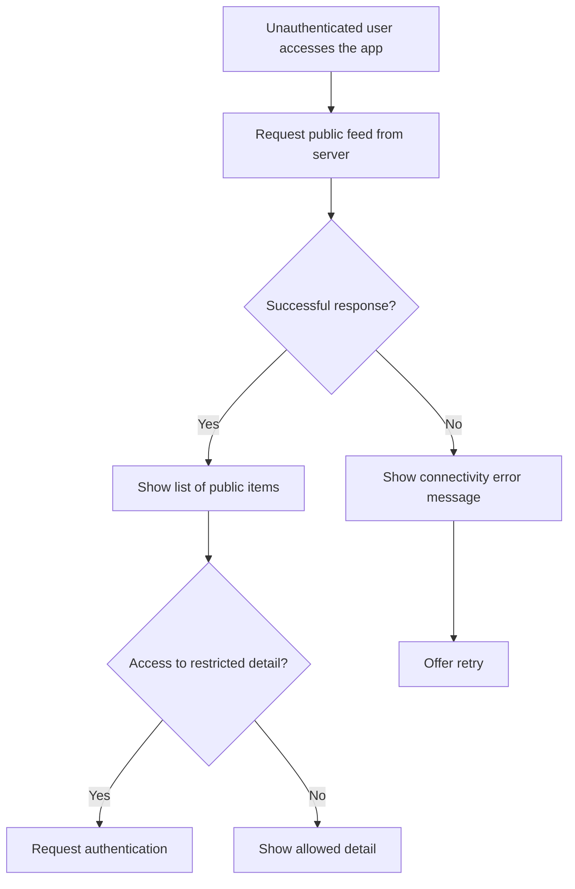

---

### Technical Flows (Happy/Sad Path)

**Happy path:**
- Unauthenticated user accesses the app
- System requests and receives the public feed
- System displays the list of public items
- User browses the feed and accesses allowed details

**Sad path 1:**
- User attempts to access restricted detail
- System requests authentication

**Sad path 2:**
- Connection fails when loading the feed
- System displays error message and allows retry

---

### Checklist Traceability <-> Tests

| Public Feed Checklist Item                     | Test Present  | Coverage  |
|:----------------------------------------------:|:-------------:|:---------:|
| Show public feed                              | No            |    ❌     |
| Hide sensitive information                    | No            |    ❌     |
| Request authentication for restricted access  | No            |    ❌     |
| Handle connectivity error                     | No            |    ❌     |
| Allow manual reload                           | No            |    ❌     |
| Show placeholders/empty states                | No            |    ❌     |

---

## 10. Authentication with External Providers

### Story: User Wants to Authenticate with External Providers

**Narrative:**  
As a user  
I want to be able to log in using external providers (Google, Apple, etc.)  
So that I can access the application quickly and securely without creating a new password

---

### Scenarios (Acceptance Criteria)
_(Reference only for QA/business. Progress is tracked solely in the technical checklist)_
- Successful authentication with external provider
- Automatic account creation if it is the first access
- Linking existing account if the email is already registered
- Handling external authentication errors
- Unlinking external provider
- Handling permission revocation from the provider
- Updating session and permissions after external authentication

---

### Technical Checklist for Authentication with External Providers

- [❌] Allow authentication with Google
- [❌] Allow authentication with Apple
- [❌] Automatically create account on first access
- [❌] Link existing account if email already exists
- [❌] Handle authentication errors and display clear messages
- [❌] Allow unlinking of external provider
- [❌] Handle permission revocation from provider
- [❌] Update session and permissions after external authentication

> Only items with real automated tests will be marked as completed. The rest must be implemented and tested before being marked as done.

---

### Technical Diagram of External Provider Authentication Flow

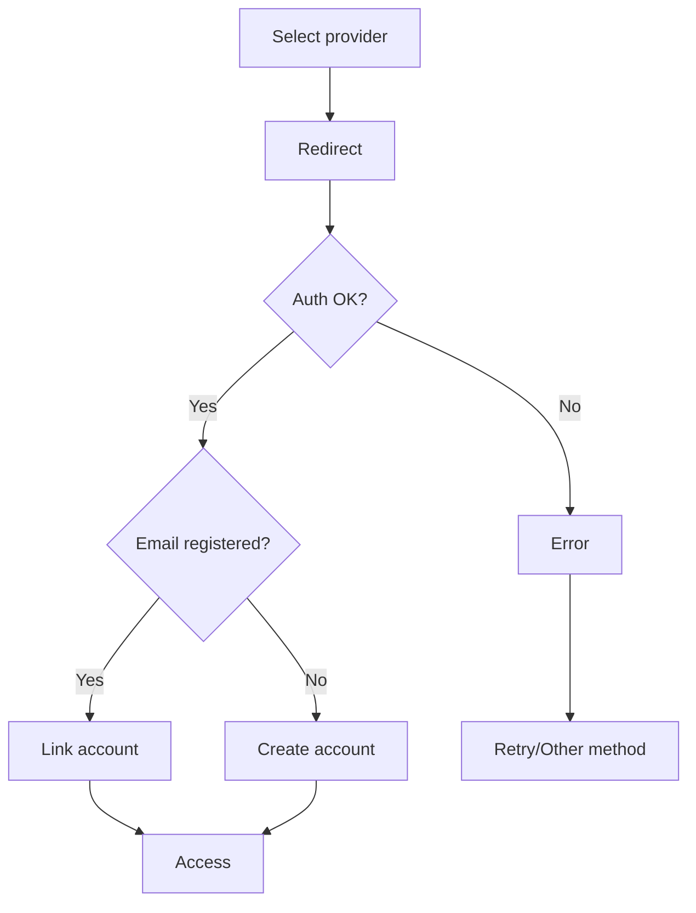

---

### Technical Flows (Happy/Sad Path)

**Happy path:**
- User selects external provider
- User is redirected and completes authentication
- System links or creates the account and updates the session
- User accesses the application with full permissions

**Sad path 1:**
- External authentication fails
- System displays error message and allows retry

**Sad path 2:**
- User revokes permissions from the provider
- System detects revocation, unlinks the account, and logs out

---

### Checklist Traceability <-> Tests

| External Authentication Checklist Item         | Test Present  | Coverage  |
|:----------------------------------------------:|:-------------:|:---------:|
| Allow authentication with Google              | No            |    ❌     |
| Allow authentication with Apple               | No            |    ❌     |
| Automatically create account                  | No            |    ❌     |
| Link existing account                         | No            |    ❌     |
| Handle authentication errors                  | No            |    ❌     |
| Allow unlinking of external provider          | No            |    ❌     |
| Handle permission revocation                  | No            |    ❌     |
| Update session and permissions                | No            |    ❌     |

---

## 11. Security Metrics

### Story: System Monitors Security Events

**Narrative:**  
As an authentication system  
I want to record and analyze security events  
So that I can detect threats and protect user accounts

---

### Scenarios (Acceptance Criteria)
_(Reference only for QA/business. Progress is tracked solely in the technical checklist)_
- Logging relevant security events
- Analyzing patterns of failed attempts
- Notifying administrators in critical events
- Almacenamiento seguro y trazable de eventos
- Medidas automáticas ante patrones sospechosos
- Visualización y consulta de métricas de seguridad

---

### Checklist técnico de métricas de seguridad

- [❌] Registrar eventos de seguridad relevantes
- [❌] Analizar patrones de intentos fallidos
- [❌] Notificar a administradores en eventos críticos
- [❌] Almacenar eventos de forma segura y trazable
- [❌] Aplicar medidas automáticas ante patrones sospechosos
- [❌] Permitir visualización y consulta de métricas

> Solo se marcarán como completados los ítems con test real automatizado. El resto debe implementarse y testearse antes de marcar como hecho.

---

### Diagrama técnico del flujo de métricas de seguridad

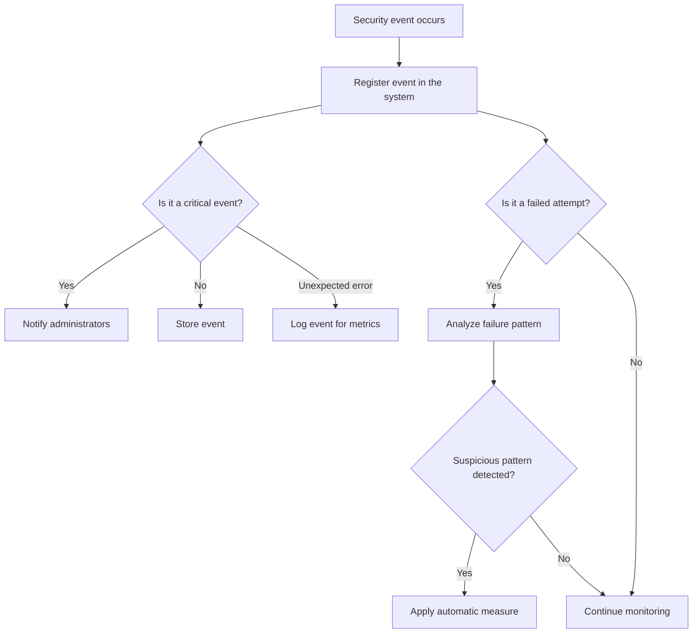

---

### Cursos técnicos (happy/sad path)

**Happy path:**
- Ocurre evento de seguridad
- El sistema lo registra correctamente
- Si es crítico, notifica a administradores
- Si es intento fallido, analiza patrones y aplica medidas si es sospechoso
- Los eventos quedan almacenados y son consultables

**Sad path 1:**
- Falla el registro del evento
- El sistema muestra mensaje de error y reintenta

**Sad path 2:**
- No se detecta patrón sospechoso a tiempo
- El sistema lo registra como incidente para análisis posterior

---

### Trazabilidad checklist <-> tests

| Ítem checklist métricas de seguridad         | Test presente | Cobertura |
|:--------------------------------------------:|:-------------:|:---------:|
| Registrar eventos de seguridad               | No            |    ❌     |
| Analizar patrones de intentos fallidos       | No            |    ❌     |
| Notificar a administradores                  | No            |    ❌     |
| Almacenar eventos de forma segura            | No            |    ❌     |
| Aplicar medidas automáticas                  | No            |    ❌     |
| Visualización y consulta de métricas         | No            |    ❌     |

---
## III. Hoja de Ruta de Seguridad Avanzada y Específica de Móvil

Esta sección describe casos de uso adicionales enfocados en el fortalecimiento de la seguridad de la aplicación a nivel de cliente y plataforma móvil. Su implementación progresiva contribuirá a una mayor robustez y protección de los datos del usuario y la integridad de la aplicación.

---

## 12. Detección de Dispositivos Comprometidos (Jailbreak/Root)

### Narrativa funcional
Como aplicación que maneja datos sensibles,
necesito intentar detectar si estoy corriendo en un dispositivo comprometido (con jailbreak o rooteado),
para tomar medidas preventivas y proteger la integridad de los datos y la funcionalidad de la aplicación.

---

### Escenarios (Criterios de aceptación)
- Detección positiva de un entorno comprometido.
- Detección negativa (dispositivo no comprometido).
- La aplicación reacciona según una política definida al detectar un entorno comprometido (ej. advertir al usuario, limitar funcionalidad, denegar el servicio, notificar al backend).

---

### Checklist técnico
- [❌] Implementar mecanismos de detección de jailbreak (iOS).
- [❌] Implementar mecanismos de detección de root (Android, si aplica).
- [❌] Definir y documentar la política de reacción de la aplicación ante un dispositivo comprometido.
- [❌] Implementar la lógica de reacción según la política.
- [❌] Considerar la ofuscación de los mecanismos de detección para dificultar su evasión.
- [❌] Tests para verificar la detección en entornos simulados o reales comprometidos.
- [❌] Tests para verificar la correcta reacción de la aplicación.

---
*(Diagrama, Cursos Técnicos y Trazabilidad a desarrollar)*
---

## 13. Protección Anti-Tampering y Ofuscación de Código

### Narrativa funcional
Como aplicación con lógica de negocio o seguridad sensible en el cliente,
necesito aplicar medidas para dificultar la ingeniería inversa, el análisis dinámico y la modificación no autorizada de mi código (tampering),
para proteger la propiedad intelectual y la efectividad de mis controles de seguridad.

---

### Escenarios (Criterios de aceptación)
- Aplicación de técnicas de ofuscación a partes críticas del código.
- Detección de debuggers adjuntos (anti-debugging).
- Verificación de la integridad del código de la aplicación en tiempo de ejecución (checksums).
- La aplicación reacciona de forma controlada si se detecta tampering o un debugger.

---

### Checklist técnico
- [❌] Identificar las secciones de código más sensibles que requieren ofuscación.
- [❌] Aplicar herramientas o técnicas de ofuscación de código (nombres de clases/métodos, strings, flujo de control).
- [❌] Implementar técnicas de detección de debuggers.
- [❌] Implementar mecanismos de verificación de checksums del código o binario.
- [❌] Definir y aplicar una política de reacción ante detección de tampering/debugging.
- [❌] Evaluar el impacto de la ofuscación en el rendimiento y la depuración.

---
*(Diagrama, Cursos Técnicos y Trazabilidad a desarrollar)*
---

## 14. Protección contra Captura/Grabación de Pantalla (Vistas Sensibles)

### Narrativa funcional
Como aplicación que puede mostrar información altamente confidencial en vistas específicas,
necesito poder prevenir o disuadir la captura o grabación de pantalla en esas vistas,
para proteger la privacidad de los datos sensibles.

---

### Escenarios (Criterios de aceptación)
- La captura de pantalla es bloqueada o la vista se oculta/muestra un overlay cuando se intenta una captura en una vista marcada como sensible.
- La grabación de pantalla muestra contenido negro u oculto para las vistas sensibles.
- Funcionalidad normal de captura/grabación en vistas no sensibles.

---

### Checklist técnico
- [❌] Identificar todas las vistas que muestran información suficientemente sensible para requerir esta protección.
- [❌] Implementar el bloqueo de capturas de pantalla en vistas sensibles (ej. usando `UIApplication.userDidTakeScreenshotNotification` y modificando la vista, o APIs específicas si existen).
- [❌] Asegurar que el contenido de vistas sensibles se oculte durante la grabación de pantalla (ej. `UIScreen.isCaptured` en iOS).
- [❌] Considerar la experiencia de usuario (ej. notificar por qué no se puede capturar).
- [❌] Tests para verificar el bloqueo/ocultamiento en vistas sensibles.

---
*(Diagrama, Cursos Técnicos y Trazabilidad a desarrollar)*
---

## 15. Fijación de Certificados (Certificate Pinning)

### Narrativa funcional
Como aplicación que se comunica con un backend crítico a través de HTTPS,
necesito asegurar que solo confío en el certificado específico (o clave pública) de mi servidor,
para protegerme contra ataques de hombre en el medio (MitM) que utilicen certificados SSL/TLS falsos o comprometidos.

---

### Escenarios (Criterios de aceptación)
- La comunicación con el backend es exitosa cuando el servidor presenta el certificado/clave pública esperado.
- La comunicación con el backend falla si el servidor presenta un certificado/clave pública diferente al esperado.
- Estrategia de actualización de los pines en la aplicación en caso de que el certificado del servidor cambie.

---

### Checklist técnico
- [❌] Decidir la estrategia de pinning (pin de certificado completo, pin de clave pública, pin de CA intermedio/raíz - menos recomendado para auto-firmados o controlados).
- [❌] Extraer el/los certificado(s) o clave(s) pública(s) del servidor de producción.
- [❌] Implementar la lógica de validación del pin en la capa de red de la aplicación (ej. `URLSessionDelegate`).
- [❌] Almacenar de forma segura los pines dentro de la aplicación.
- [❌] Definir y probar la estrategia de actualización de los pines (ej. a través de una actualización de la app, o un mecanismo de entrega seguro si es dinámico).
- [❌] Tests exhaustivos para conexiones exitosas (pin correcto) y fallidas (pin incorrecto, certificado diferente).

---
*(Diagrama, Cursos Técnicos y Trazabilidad a desarrollar)*
---
## 16. Manejo Seguro de Datos Sensibles en Memoria

### Narrativa funcional
Como aplicación que maneja temporalmente datos altamente sensibles (ej. contraseñas, claves de API, tokens de sesión) en memoria,
necesito minimizar el tiempo de exposición de estos datos y asegurar su limpieza de la memoria tan pronto como ya no sean necesarios,
para reducir el riesgo de que sean extraídos por malware o herramientas de análisis de memoria.

---

### Escenarios (Criterios de aceptación)
- Las contraseñas ingresadas por el usuario se limpian de la memoria después de ser usadas para la autenticación o el cambio de contraseña.
- Las claves de API o tokens de sesión se manejan con cuidado y se limpian si es posible cuando la sesión termina o ya no son válidos.
- Uso de tipos de datos seguros si la plataforma/lenguaje los provee (ej. `SecureString` en otros contextos, o técnicas equivalentes en Swift).

---

### Checklist técnico
- [❌] Identificar todas las variables y estructuras de datos que contienen información crítica en memoria.
- [❌] Implementar la sobrescritura o puesta a nil de estas variables tan pronto como su contenido ya no sea necesario.
- [❌] Investigar y utilizar, si es posible, tipos de datos o técnicas que dificulten la persistencia en memoria o la extracción (ej. manejo cuidadoso de `String` para contraseñas).
- [❌] Ser consciente de las optimizaciones del compilador que podrían mantener copias de datos en memoria.
- [❌] Para datos muy críticos, considerar el uso de porciones de memoria no intercambiables (si la plataforma lo permite y es justificable).
- [❌] Realizar análisis de memoria (si es posible con herramientas) para verificar la limpieza de datos.

---
*(Diagrama, Cursos Técnicos y Trazabilidad a desarrollar)*
---

## 17. Autenticación Biométrica Segura (Touch ID/Face ID)

### Narrativa funcional
Como usuario, quiero poder utilizar la autenticación biométrica de mi dispositivo (Touch ID/Face ID) para acceder a la aplicación o autorizar operaciones sensibles de forma rápida y segura,
y como aplicación, necesito integrar esta funcionalidad correctamente, manejando los posibles fallos y respetando la seguridad de las credenciales subyacentes.

---

### Escenarios (Criterios de aceptación)
- Configuración exitosa de la autenticación biométrica para la app (si requiere un "opt-in").
- Autenticación biométrica exitosa permite el acceso/autorización.
- Fallos en la autenticación biométrica (ej. no reconocimiento, demasiados intentos) son manejados correctamente, ofreciendo un fallback (ej. PIN/contraseña de la app).
- Cambios en la configuración biométrica del dispositivo (ej. nuevos dedos/rostros añadidos, biometría desactivada) invalidan o requieren revalidación de la configuración biométrica de la app.
- Las claves o tokens protegidos por biometría se almacenan de forma segura (ej. en Keychain con el flag `kSecAccessControlBiometryCurrentSet` o similar).

---

### Checklist técnico
- [❌] Integrar el framework `LocalAuthentication`.
- [❌] Solicitar permiso para usar biometría de forma contextual.
- [❌] Manejar todos los posibles códigos de error de `LAError`.
- [❌] Implementar un mecanismo de fallback seguro si la biometría falla o no está disponible.
- [❌] Para proteger datos con biometría, usar atributos de Keychain que requieran autenticación biométrica para el acceso (`kSecAccessControl...`).
- [❌] Considerar el manejo del `evaluatedPolicyDomainState` para detectar cambios en la configuración biométrica del sistema y revalidar si es necesario.
- [❌] Proporcionar feedback claro al usuario durante el proceso de autenticación.
- [❌] Tests para flujos exitosos, fallidos, y de fallback.

---
*(Diagrama, Cursos Técnicos y Trazabilidad a desarrollar)*
---

## 18. Logout Seguro Detallado (Invalidación en Servidor)

### Narrativa funcional
Como usuario, cuando cierro sesión en la aplicación,
quiero que mi sesión se invalide completamente, no solo localmente, sino también en el servidor si es posible,
para asegurar que los tokens de sesión anteriores ya no puedan ser utilizados.

---

### Escenarios (Criterios de aceptación)
- Al cerrar sesión, todos los datos de sesión locales (tokens, caché de usuario) son eliminados.
- Si el backend soporta la invalidación de tokens, se realiza una llamada al endpoint de logout del servidor para invalidar el token actual.
- El usuario es redirigido a la pantalla de login o a un estado no autenticado.
- Fallos en la llamada de invalidación del servidor son manejados (ej. la limpieza local aún ocurre, se puede reintentar o informar).

---

### Checklist técnico
- [❌] Implementar la limpieza completa de todos los datos de sesión almacenados localmente (Keychain, UserDefaults, variables en memoria).
- [❌] Si el backend tiene un endpoint de logout para invalidar tokens (ej. JWT en una blacklist), implementar la llamada a este endpoint.
- [❌] Manejar la respuesta del servidor (éxito/error) de la llamada de invalidación.
- [❌] Asegurar que la UI refleje correctamente el estado de no autenticado.
- [❌] Tests para verificar la limpieza local y la llamada al servidor.

---
*(Diagrama, Cursos Técnicos y Trazabilidad a desarrollar)*
---
## 19. Gestión Segura de Permisos del Dispositivo

### Functional Narrative
As an application that requires certain device permissions (e.g., location, contacts, camera, notifications) to offer its full functionality,
I need to request and manage these permissions transparently, securely, and respectfully of the user's privacy,
ensuring that they are only requested when necessary and that the user understands why.

---

### Scenarios (Acceptance Criteria)
- Permissions are requested only when a feature that requires them is about to be used for the first time (contextual request).
- A clear explanation is provided to the user about why the permission is needed before the system's formal request.
- The app correctly handles cases where the user grants or denies the permission.
- The app behaves predictably and offers alternatives (if possible) when a required permission is denied.
- The app respects the revocation of permissions by the user from system settings.
- The permission state is checked before attempting to use features that require them (do not assume a previously granted permission is still active).

---

### Technical Checklist
- [❌] Identify all device permissions the app needs and for which features.
- [❌] Implement permission requests using the platform's correct APIs (e.g., `CoreLocation`, `Contacts`, `UserNotifications`).
- [❌] Design and implement a "pre-request" UI to explain the need for the permission before the system alert.
- [❌] Handle all permission authorization states (granted, denied, restricted, not determined).
- [❌] Provide guidance to the user on how to change permissions in system settings if initially denied and then wanted.
- [❌] Check the current permission state every time a dependent feature is about to be used.
- [❌] Ensure the app does not crash or behave unexpectedly if a permission is denied or revoked.
- [❌] Tests for all request flows and permission states.

---
*(Diagram, Technical Flows, and Traceability to be developed)*
---

